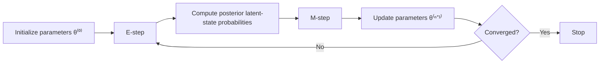

## Basic Probability for EM {#basic-probability-for-em}

The **Expectation-Maximization (EM) algorithm** is an optimization algorithm commonly used to obtain **maximum-likelihood estimates** in models containing ==**latent variables**==.

Before introducing EM itself, several probability rules are required.

For two events $A$ and $B$, the joint probability can be factorized as

$$
P(A,B)
=
P(A|B)P(B)
=
P(B|A)P(A).
$$

From this relation, **Bayes' theorem** follows:

$$
P(A|B)
=
\frac{P(B|A)P(A)}{P(B)}.
$$

Another important identity is the **law of total probability**:

$$
P(B)
=
\sum_i P(B|A_i)P(A_i).
$$

The same rules also apply when conditioning on an additional variable $C$:

$$
P(A,B|C)
=
P(A|B,C)P(B|C),
$$

and

$$
P(A|B,C)
=
\frac{P(B|A,C)P(A|C)}
{P(B|C)}.
$$

These identities are important for EM because latent states are not directly observed. Their possible values therefore have to be ==**summed over or inferred probabilistically**==.

## Expectation {#expectation}

For a discrete random variable $X$,

$$
E[X]
=
\sum_x P(X=x)x.
$$

For a continuous random variable,

$$
E[X]
=
\int_a^b f(x)x\,dx.
$$

The key idea is that an unknown quantity does not necessarily have to be replaced by one hard guess. Instead, all possible states can contribute according to their probabilities.

This principle becomes central in the **E-step** of the EM algorithm.

## Latent Variables {#latent-variables}

A **latent variable** is a variable that is part of the statistical model but is not directly observed.

Suppose

- $X$ is the observed data;
- $Z$ is an unobserved latent state;
- $\theta$ is the parameter vector to be estimated.

The likelihood of the observed data is

$$
p(X|\theta).
$$

If the latent variable $Z$ were observed, parameter estimation could often be much easier.

However, because $Z$ is unknown, the likelihood must account for all possible latent states:

$$
p(X|\theta)
=
\sum_Z p(X,Z|\theta).
$$

Therefore,

$$
\boxed{
\text{Latent-variable models require marginalization over unobserved states.}
}
$$

## The Two-Coin Example {#two-coin-example}

The lecture introduces EM using a two-coin example.

Five sequences of ten coin tosses are observed:

```text
HTTTHHTHTH
HHHHTHHHHH
HTHTTTHHTT
HTHTTTHHTT
THHHTHHHTH
```

Let

$$
X=(X_1,\ldots,X_5)
$$

denote the observed sequences.

Each sequence was generated by either **coin A** or **coin B**, but the identity of the coin is not observed.

The latent variable is therefore

$$
Z=(Z_1,\ldots,Z_5),
\qquad
Z_i \in \{A,B\}.
$$

The unknown parameters are

$$
\theta_A
\quad\text{and}\quad
\theta_B,
$$

where

- $\theta_A$ is the probability of heads for coin A;
- $\theta_B$ is the probability of heads for coin B.

The lecture assumes equal prior probabilities for the two coins:

$$
P(Z_i=A)=P(Z_i=B)=0.5.
$$

The problem is therefore:

> Estimate the head probabilities of two coins when the generating coin for each observed sequence is unknown.

This is a simple example of a ==**mixture model with latent class assignments**==.

## Likelihood with Latent Variables {#likelihood-with-latent-variables}

Assuming that the observed sequences are independent,

$$
p(X|\theta)
=
\prod_{i=1}^{5}p(X_i|\theta).
$$

Because the generating coin is unknown, the probability of one observation is obtained using the law of total probability:

$$
p(X_i|\theta)
=
\sum_{z\in\{A,B\}}
p(X_i|\theta,Z_i=z)
P(Z_i=z).
$$

Therefore,

$$
p(X|\theta)
=
\prod_{i=1}^{5}
\sum_{z\in\{A,B\}}
p(X_i|\theta_z)
P(Z_i=z).
$$

For each coin $z$, the number of heads in a sequence follows a **binomial model**.

If a sequence contains $k$ heads in $n=10$ tosses,

$$
p(X_i|\theta_z)
=
B(k:n,\theta_z).
$$

Equivalently,

$$
p(X_i|\theta_z)
=
\binom{n}{k}
\theta_z^k
(1-\theta_z)^{n-k}.
$$

Thus, for a given parameter guess $(\theta_A,\theta_B)$, we can calculate how likely each observed sequence is under each coin.

## Posterior Probability of the Latent State {#posterior-probability-of-latent-state}

The next step is to infer which coin most likely generated each sequence.

Using Bayes' theorem,

$$
P(Z_i=z|X_i,\theta)
=
\frac{
P(X_i|Z_i=z,\theta)P(Z_i=z|\theta)
}{
P(X_i|\theta)
}.
$$

Expanding the denominator,

$$
P(Z_i=z|X_i,\theta)
=
\frac{
P(X_i|Z_i=z,\theta)P(Z_i=z)
}{
\sum_{z'\in\{A,B\}}
P(X_i|Z_i=z',\theta)P(Z_i=z')
}.
$$

This quantity is the ==**posterior probability of the latent state**==.

For example, instead of assigning a sequence directly to coin A, EM may obtain

$$
P(Z_i=A|X_i,\theta)=0.8,
$$

and

$$
P(Z_i=B|X_i,\theta)=0.2.
$$

The sequence therefore contributes partially to both coins.

This is a **soft assignment**, in contrast to a hard classification such as

$$
Z_i=A.
$$

::: note
The lecture defines the posterior probability as the probability that sequence $i$ was generated by coin $z$, given the observed sequence and the current parameter values.
:::

## Intuition Behind EM {#intuition-behind-em}

The EM algorithm alternates between two tasks:

1. infer the latent variables using the current parameter estimates;
2. update the parameters using the inferred latent-variable probabilities.

Conceptually,

$$
\boxed{
\text{Estimate hidden states}
\rightarrow
\text{Update parameters}
\rightarrow
\text{repeat}
}
$$

The important point is that EM does not usually fill in the latent variables with one fixed value. Instead, it uses their **posterior probabilities**.

## E-step {#e-step}

In iteration $n$, suppose the current parameter estimate is

$$
\theta^{(n)}.
$$

The **Expectation step** computes

$$
q_i(Z_j)
=
P(Z_j|X_i,\theta^{(n)}).
$$

In the coin example, this means calculating

$$
P(Z_i=A|X_i,\theta^{(n)})
$$

and

$$
P(Z_i=B|X_i,\theta^{(n)})
$$

for every observed sequence.

For coin A, the posterior weight can be written as

$$
w_{iA}
=
\frac{
p(X_i|\theta_A)P(Z_i=A)
}{
p(X_i|\theta_A)P(Z_i=A)
+
p(X_i|\theta_B)P(Z_i=B)
}.
$$

Similarly,

$$
w_{iB}
=
1-w_{iA}.
$$

With equal prior probabilities,

$$
P(Z_i=A)=P(Z_i=B)=0.5.
$$

The E-step therefore produces the expected contribution of each sequence to each coin.

## M-step {#m-step}

The **Maximization step** updates the model parameters by maximizing the expected complete-data log-likelihood.

Formally,

$$
\theta^{(n+1)}
=
\operatorname*{argmax}_{\theta}
Q(\theta|\theta^{(n)}).
$$

The function $Q$ is

$$
Q(\theta|\theta^{(n)})
=
\sum_i\sum_j
q_i(Z_j)
\log p(X_i,Z_j|\theta).
$$

In the coin example, the posterior probabilities from the E-step act as weights.

Therefore, the updated probability of heads for coin A is obtained from the ==**expected number of heads assigned to A divided by the expected total number of tosses assigned to A**==.

Likewise for coin B.

The lecture illustrates one EM step in R using the same idea:

```r
lik <- cbind(
  dbinom(data, 10, pk[1]),
  dbinom(data, 10, pk[2])
)

wA <- lik[,1] * 0.5 /
      (lik[,1] * 0.5 + lik[,2] * 0.5)

wB <- lik[,2] * 0.5 /
      (lik[,1] * 0.5 + lik[,2] * 0.5)
```

The parameter update then uses these weights to calculate the new estimates.

## The EM Algorithm {#em-algorithm}

The complete EM procedure can be summarized as follows.

::: steps

1. **Initialize the parameters**

   Choose an initial value

   $$
   \theta^{(0)}.
   $$

2. **E-step**

   Compute

   $$
   q_i(Z_j)
   =
   P(Z_j|X_i,\theta^{(n)}).
   $$

3. **M-step**

   Compute

   $$
   \theta^{(n+1)}
   =
   \operatorname*{argmax}_{\theta}
   Q(\theta|\theta^{(n)}).
   $$

4. **Repeat**

   Continue alternating between the E-step and M-step until the parameters converge.

:::

The algorithm can therefore be represented as



## Why Direct Optimization Is Difficult {#why-direct-optimization-is-difficult}

The observed-data likelihood is

$$
L(\theta)
\propto
p(X|\theta).
$$

The goal is to find

$$
\hat{\theta}
=
\operatorname*{argmax}_{\theta}
L(\theta)
=
\operatorname*{argmax}_{\theta}
\log L(\theta).
$$

For independent observations,

$$
\log L(\theta)
=
\sum_i
\log p(X_i|\theta).
$$

When latent variables are present,

$$
p(X_i|\theta)
=
\sum_j p(X_i,Z_j|\theta),
$$

so

$$
\log L(\theta)
=
\sum_i
\log
\left(
\sum_j
p(X_i,Z_j|\theta)
\right).
$$

The difficult part is the expression

$$
\log\left(\sum_j \cdots\right).
$$

The sum over latent states is inside the logarithm, which makes direct maximization inconvenient.

## Jensen's Inequality {#jensens-inequality}

To derive EM, the lecture uses **Jensen's inequality**.

For a convex function $f$,

$$
E[f(X)]
\geq
f(E[X]).
$$

For a concave function,

$$
E[f(X)]
\leq
f(E[X]).
$$

The logarithm is **strictly concave**, so

$$
E[\log X]
\leq
\log E[X].
$$

Equivalently,

$$
\log E[X]
\geq
E[\log X].
$$

This inequality allows us to construct a lower bound for the log-likelihood.

## Lower Bound of the Log-Likelihood {#lower-bound-log-likelihood}

Introduce an arbitrary probability distribution $q_i(Z_j)$ satisfying

$$
\sum_j q_i(Z_j)=1.
$$

Then

$$
\log L(\theta)
=
\sum_i
\log
\left(
\sum_j
p(X_i,Z_j|\theta)
\right).
$$

Multiplying and dividing by $q_i(Z_j)$,

$$
\log L(\theta)
=
\sum_i
\log
\left(
\sum_j
q_i(Z_j)
\frac{
p(X_i,Z_j|\theta)
}{
q_i(Z_j)
}
\right).
$$

The quantity inside the logarithm can be interpreted as an expectation with respect to $q_i$.

Using Jensen's inequality,

$$
\log L(\theta)
\geq
\sum_i
\sum_j
q_i(Z_j)
\log
\left(
\frac{
p(X_i,Z_j|\theta)
}{
q_i(Z_j)
}
\right).
$$

Thus, EM constructs a ==**lower bound on the log-likelihood**==.

The lower bound can also be written as

$$
\sum_i\sum_j
q_i(Z_j)
\log p(X_i,Z_j|\theta)
-
\sum_i\sum_j
q_i(Z_j)\log q_i(Z_j).
$$

The lecture denotes this conceptually as

$$
Q(\theta|\theta^{(n)})
+
H(Q),
$$

where the second term does not depend on $\theta$ during the M-step.

## Choosing the Best Lower Bound {#choosing-best-lower-bound}

The lower bound is most useful when it touches the true log-likelihood at the current parameter estimate.

This happens when

$$
q_i(Z_j)
=
P(Z_j|X_i,\theta^{(n)}).
$$

This is exactly the E-step.

Therefore,

$$
\boxed{
\text{E-step chooses } q
\text{ so that the lower bound is tight at the current parameters.}
}
$$

The M-step then maximizes this lower bound with respect to $\theta$.

Hence,

$$
\boxed{
\text{M-step moves to parameters with a larger or equal lower bound.}
}
$$

## Why EM Works {#why-em-works}

Let the parameters before the M-step be $\theta^{(n)}$ and after the M-step be $\theta^{(n+1)}$.

Because the E-step makes the lower bound tight at $\theta^{(n)}$,

$$
\log L(\theta^{(n)})
=
\text{lower bound at }\theta^{(n)}.
$$

The M-step maximizes the lower bound, so

$$
\text{lower bound at }\theta^{(n+1)}
\geq
\text{lower bound at }\theta^{(n)}.
$$

The true log-likelihood is always at least as large as the lower bound:

$$
\log L(\theta^{(n+1)})
\geq
\text{lower bound at }\theta^{(n+1)}.
$$

Combining these relations gives

$$
\log L(\theta^{(n+1)})
\geq
\log L(\theta^{(n)}).
$$

Therefore,

$$
\boxed{
\text{EM does not decrease the likelihood from one iteration to the next.}
}
$$

This explains why the iteration moves toward a maximum of the likelihood surface.

::: note
The lecture demonstrates this using trajectories on a log-likelihood surface. Different initial parameter values follow different iterative paths toward higher-likelihood regions.
:::

## M-step for Mixture Proportions {#m-step-mixture-proportions}

The lecture derives a special case in which

$$
P(Z_j|\theta)=\theta_j,
$$

with

$$
\sum_j \theta_j=1.
$$

The relevant part of the $Q$ function becomes

$$
Q(\theta)
=
\sum_i\sum_j
q_i(Z_j)\log\theta_j.
$$

Because the parameters must satisfy

$$
\sum_j \theta_j=1,
$$

a **Lagrange multiplier** is introduced.

Define

$$
f(\theta)
=
\sum_i\sum_j
q_i(Z_j)\log\theta_j
+
\beta
\left(
\sum_j\theta_j-1
\right).
$$

Differentiating with respect to $\theta_j$ gives

$$
\frac{\partial f}{\partial \theta_j}
=
\frac{
\sum_i q_i(Z_j)
}{
\theta_j
}
+
\beta.
$$

Setting the derivative to zero leads to

$$
\theta_j^{(n+1)}
=
\frac{
\sum_i q_i(Z_j)
}{
\sum_i\sum_j q_i(Z_j)
}.
$$

Because each observation has posterior probabilities that sum to one,

$$
\sum_j q_i(Z_j)=1,
$$

the denominator is simply the total number of observations.

Therefore,

$$
\boxed{
\theta_j^{(n+1)}
=
\frac{
\text{expected number of observations in state }j
}{
\text{total number of observations}
}
}
$$

This is the intuitive interpretation of the M-step for mixture proportions.

## EM as Soft Counting {#em-soft-counting}

A useful way to understand EM is as ==**iterative soft counting**==.

If the latent states were observed, parameter estimation would involve ordinary counts.

For example,

```text
Sequence 1 -> Coin A
Sequence 2 -> Coin A
Sequence 3 -> Coin B
```

would give integer counts.

With latent states, EM instead uses expected counts:

```text
Sequence 1 -> 0.95 Coin A + 0.05 Coin B
Sequence 2 -> 0.70 Coin A + 0.30 Coin B
Sequence 3 -> 0.10 Coin A + 0.90 Coin B
```

These weighted counts are then used in the M-step.

Thus,

$$
\boxed{
\text{EM replaces unknown hard assignments with expected assignments.}
}
$$

## EM Algorithm Summary {#em-algorithm-summary}

The overall problem is

$$
\log L(\theta)
=
\sum_i
\log
\left(
\sum_j
p(X_i,Z_j|\theta)
\right),
$$

where $Z$ is unobserved.

The EM algorithm alternates between two steps.

### E-step {#summary-e-step}

Calculate the posterior distribution of the latent state:

$$
\boxed{
q_i(Z_j)
=
P(Z_j|X_i,\theta^{(n)})
}
$$

### M-step {#summary-m-step}

Maximize the expected complete-data log-likelihood:

$$
\boxed{
\theta^{(n+1)}
=
\operatorname*{argmax}_{\theta}
Q(\theta|\theta^{(n)})
}
$$

For the special mixture-proportion model,

$$
\boxed{
\theta_j^{(n+1)}
=
\frac{
\sum_i q_i(Z_j)
}{
\sum_i\sum_j q_i(Z_j)
}
}
$$

The iterations continue until convergence.

## Key Points {#key-points}

The most important concepts to remember are:

- **EM is an optimization algorithm** used mainly for maximum-likelihood estimation.
- It is particularly useful when the model contains ==**latent variables**==.
- The observed-data likelihood is obtained by **summing over latent states**.
- The **E-step** calculates posterior probabilities of latent states.
- The **M-step** updates parameters by maximizing the expected complete-data log-likelihood.
- Latent states are usually represented using **soft assignments**, not hard classifications.
- **Bayes' theorem** is used to calculate posterior latent-state probabilities.
- **Jensen's inequality** is used to derive a lower bound on the log-likelihood.
- The E-step makes the lower bound **tight at the current parameter estimate**.
- The M-step increases or preserves the lower bound.
- Therefore, ==**the likelihood does not decrease between EM iterations**==.
- For mixture proportions, the M-step reduces to normalized expected counts.

The core logic of EM can be summarized as

$$
\boxed{
\text{current parameters}
\rightarrow
\text{posterior latent-state probabilities}
\rightarrow
\text{updated parameters}
\rightarrow
\text{repeat}
}
$$

