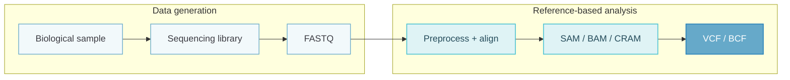
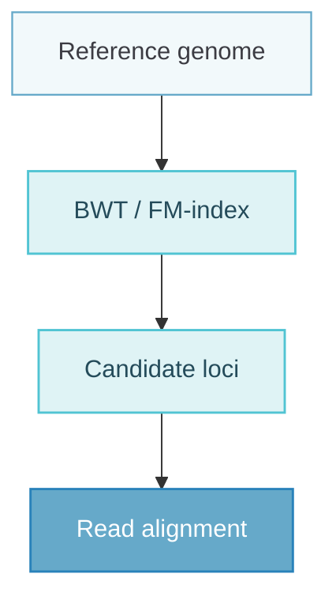
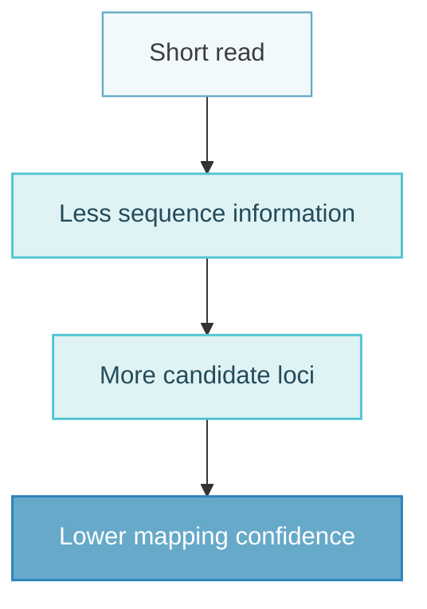
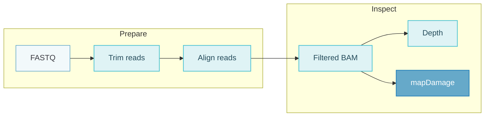
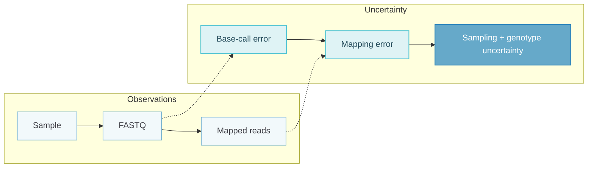

## Overview of the NGS Workflow {#overview-of-the-ngs-workflow}

The first week introduces how next-generation sequencing (**NGS**) data are represented and transformed from raw sequencing output into data that can be used for biological inference.

A useful way to organize the workflow is:



The diagram groups the workflow into two compact stages: **data generation** and **reference-based analysis**. The same distinction is used throughout this note.

The important point is that the sequencer does ==**not**== directly observe a genotype or a variant.

Instead, the data pass through several layers of uncertainty:

- uncertainty in the biological sample;
- sequencing errors;
- uncertainty in read placement;
- stochastic variation in sequencing depth;
- uncertainty when inferring an underlying genotype from reads.

This distinction becomes especially clear when considering **ancient DNA**, where all of these problems are amplified.

---

## Ancient DNA {#ancient-dna}

Ancient DNA (**aDNA**) can be extracted from many types of biological and environmental material, including:

- bone;
- teeth and dental calculus;
- hair;
- skin and fur;
- plants, seeds, and pollen;
- coprolites;
- sediments;
- ice cores.

Ancient samples are useful for demonstrating the difficulties of NGS analysis because authentic aDNA is typically ==**short, damaged, contaminated, and present at low concentration**==.

## DNA Degradation After Death {#dna-degradation-after-death}

DNA progressively breaks down after death.

One major consequence is fragmentation of the DNA backbone, producing increasingly short molecules.

```text
Long intact DNA
----------------------------

After degradation
-------   -----    ------
   ----       ---      ----

Further degradation
---  --   ----  --   ---
```

Ancient sequencing libraries therefore often contain much shorter fragments than modern libraries.

Short fragments matter computationally because they:

- are more likely to contain sequenced adapter sequence;
- are more difficult to map uniquely;
- contain less information for identifying their genomic origin.

### Post-mortem Damage {#post-mortem-damage}

DNA also undergoes chemical modification after death.

One characteristic process is **cytosine deamination**:

$$
C \rightarrow U
$$

During sequencing, uracil is usually interpreted as thymine. This produces an apparent:

$$
C \rightarrow T
$$

substitution.

Because the complementary strand is also represented, ancient DNA commonly shows:

- increased **C→T** substitutions close to the $5'$ end;
- increased **G→A** substitutions close to the $3'$ end.

A simplified representation is:

```text
5'                                 3'
C→T  C→T  -------------------  G→A  G→A
^^^^                              ^^^^
high damage                    high damage
```

This leads to an important property of aDNA analysis:

$$
\boxed{
\text{DNA damage is both an error source and an authenticity signal}
}
$$

The damage pattern can therefore be used to distinguish ancient molecules from modern contamination.

---

## Endogenous DNA and Contamination {#endogenous-dna-and-contamination}

A sequencing library from an ancient specimen does not contain only DNA from the organism of interest.

For example, DNA extracted from a human archaeological sample can contain:

```text
ancient human DNA
environmental microbial DNA
unknown DNA
modern human contamination
```

The fraction of sequencing data originating from the target organism is called the **endogenous DNA fraction**.

A sample may therefore generate many sequencing reads while only a small fraction maps to the target genome.

### Avoiding Modern Contamination {#avoiding-modern-contamination}

Contamination can be reduced by:

- minimizing physical contact during collection;
- using gloves and protective equipment;
- storing samples in sealed containers;
- keeping samples refrigerated or frozen;
- using dedicated aDNA laboratory procedures.

Contamination can also be investigated after sequencing, for example using:

- mitochondrial DNA;
- Y-chromosome information;
- X-chromosome information.

### Sample Type Matters {#sample-type-matters}

Different skeletal elements preserve DNA with very different efficiencies.

The **petrous bone** is particularly important in ancient human genomics because it often contains substantially more endogenous DNA than teeth or many other bones.

Therefore:

$$
\boxed{
\text{Sequencing success depends on sample preservation before it depends on sequencing depth}
}
$$

---

## Sequencing Libraries {#sequencing-libraries}

A sequencing library is a collection of DNA fragments prepared for sequencing.

A typical library fragment consists of an unknown DNA insert surrounded by known adapter sequences:

```text
known adapter | unknown DNA fragment | known adapter
```

Adapters may contain:

- sequences required by the sequencing platform;
- sample indices;
- primer-binding regions.

### Library Complexity {#library-complexity}

**Library complexity** describes the number of distinct original DNA molecules represented in a library.

A high-complexity library contains many unique molecules:

```text
A B C D E F G H I J
```

A low-complexity library may repeatedly contain copies derived from the same original molecules:

```text
A A B A C A B A C A
```

As sequencing depth increases, a low-complexity library eventually produces mostly duplicate observations.

Therefore:

$$
\boxed{
\text{More sequencing reads} \not\Rightarrow \text{proportionally more biological information}
}
$$

### Clonality {#clonality}

**Clonality** is related to the repeated sequencing of molecules derived from the same original DNA fragment.

Higher clonality generally means that a larger fraction of the sequencing output is redundant.

This is especially relevant for:

- low-input samples;
- ancient DNA;
- strongly amplified libraries.

---

## FASTA Files {#fasta-files}

FASTA is a simple text format used to represent nucleotide or protein sequences.

A FASTA record contains a sequence identifier beginning with `>` followed by the sequence itself.

```text
>sequence1
CACCTCCCCTCAGGCCGCATTGCAGTGGGGG
>sequence2
CGCGCTGTCCGCGCTGAGCCACCTGCACGCG
```

A single FASTA file may contain many sequences, for example:

- chromosomes;
- contigs;
- transcripts;
- proteins.

FASTA represents the sequence itself but does ==**not**== normally contain per-base sequencing quality.

### FASTA Indexing {#fasta-indexing}

A FASTA file can be indexed with `samtools faidx`:

```bash
samtools faidx genome.fa
```

This creates:

```text
genome.fa.fai
```

The index allows rapid random access to specific regions.

For example:

```bash
samtools faidx genome.fa chr21:1000-1100
```

The coordinate convention used by `samtools faidx` is ==**1-based and inclusive**==.

Therefore:

$$
\text{length} = 1100 - 1000 + 1 = 101
$$

::: note
Coordinate systems must always be interpreted in the context of the file format or program being used. Different genomics formats do not necessarily use the same coordinate convention.
:::

### Useful FASTA Operations {#useful-fasta-operations}

Count the number of records:

```bash
grep -c "^>" genome.fa
```

Extract sequence names:

```bash
grep "^>" genome.fa | tr -d ">"
```

Inspect sequence names and lengths:

```bash
cut -f1,2 genome.fa.fai
```

Extract a specific region:

```bash
samtools faidx genome.fa chr21:1000-1100
```

---

## FASTQ Files {#fastq-files}

FASTQ is the standard representation of sequencing reads together with their base-quality scores.

Each record consists of four lines:

```text
@read_identifier
ACGTTGCAACGT
+
IIIIIIIIIIII
```

::: table align="center" copy="all"

| Line | Content | Description |
| :---: | --- | --- |
| 1 | Read ID | Begins with `@` |
| 2 | Sequence | Base calls from the sequencer |
| 3 | Separator | Begins with `+` |
| 4 | Quality | One quality character per base |

:::

The sequence and quality strings must have the same length.

### Inspecting FASTQ Files {#inspecting-fastq-files}

Compressed FASTQ files can be read without permanently decompressing them:

```bash
zcat reads.fastq.gz | head -4
```

Because each FASTQ record has exactly four lines, sequence lines can be selected with:

```bash
zcat reads.fastq.gz | awk 'NR%4==2'
```

The same idea can be used to calculate the mean read length:

```bash
zcat reads.fastq.gz |
awk 'NR%4==2{sum+=length($0)}END{print sum/(NR/4)}'
```

or to count reads:

```bash
zcat reads.fastq.gz |
awk 'NR%4==2' |
wc -l
```

::: note
A command such as `grep -c "GATTACA"` counts matching **lines**, not necessarily the total number of motif occurrences. One sequence line containing the motif twice would still contribute only one to `grep -c`.
:::

---

## Phred Quality Scores {#phred-quality-scores}

A FASTQ quality score represents the estimated probability that a base call is incorrect.

The **Phred score** is defined as:

$$
Q = -10\log_{10}(\epsilon)
$$

where $\epsilon$ is the probability of an incorrect base call.

Equivalently:

$$
\epsilon = 10^{-Q/10}
$$

::: table align="center" copy="all"

| Phred score | Error probability | Approximate accuracy |
| :---: | :---: | :---: |
| Q10 | $10^{-1}$ | 90% |
| Q20 | $10^{-2}$ | 99% |
| Q30 | $10^{-3}$ | 99.9% |
| Q40 | $10^{-4}$ | 99.99% |

:::

FASTQ normally stores quality values using ASCII characters rather than literal integers.

For Phred+33 encoding:

$$
\text{ASCII code} = Q + 33
$$

The important biological interpretation is:

$$
\boxed{
\text{A nucleotide in FASTQ is an observation with uncertainty}
}
$$

---

## Adapter Trimming {#adapter-trimming}

If a DNA insert is shorter than the sequencing read length, sequencing can continue beyond the insert and into the adapter.

```text
DNA insert
|----------|

sequenced read
|---------------------------->
           ^^^^^^^^^^^^^^^^^^
              adapter
```

This is particularly common in ancient DNA because ancient fragments are often short.

The practical exercises use **fastp** for trimming and filtering.

```bash
fastp \
  --in1 R1.fastq.gz \
  --in2 R2.fastq.gz \
  --out1 R1_trimmed.fastq.gz \
  --out2 R2_trimmed.fastq.gz \
  --merge \
  --merged_out merged.fastq.gz \
  --length_required 30 \
  --detect_adapter_for_pe
```

`fastp` can simultaneously perform:

- adapter detection and trimming;
- filtering of low-quality reads;
- filtering of reads containing too many `N` bases;
- minimum-length filtering;
- paired-end read merging;
- summary reporting.

### Paired-end Merging {#paired-end-merging}

For paired-end sequencing, the same DNA insert is read from both ends.

If the insert is short enough, the two reads overlap:

```text
R1  ---------------->
        <----------------  R2
        overlap
```

The overlap can be used to reconstruct one merged sequence.

A high proportion of mergeable read pairs can therefore indicate short DNA inserts.

---

## Reference Alignment {#reference-alignment}

After preprocessing, reads can be mapped to a reference genome.

An alignment answers a more complex question than simply:

> Does this sequence exist in the reference?

Instead, it attempts to determine:

- which reference sequence the read belongs to;
- its genomic position;
- its orientation;
- the mismatch/indel structure;
- whether alternative placements are possible;
- how confident the mapper is in the placement.

Common aligners include:

- BWA;
- Bowtie;
- Bowtie2;
- MAQ;
- SOAP2;
- Mosaik;
- DRAGEN.

The Week 1 practical exercises mainly use **BWA**.

---

## Burrows-Wheeler Based Mapping {#burrows-wheeler-based-mapping}

Searching every read against every possible reference position directly would be inefficient.

BWA first builds an index of the reference:

```bash
bwa index reference.fa
```

The index is based on the **Burrows-Wheeler Transform (BWT)** and related indexing structures.

Conceptually:



The practical exercises compare different BWA workflows.

For short reads:

```bash
bwa aln -t 2 reference.fa reads.fastq.gz > reads.sai
bwa samse reference.fa reads.sai reads.fastq.gz > output.sam
```

For BWA MEM:

```bash
bwa mem -t 2 reference.fa reads.fastq.gz > output.sam
```

One exercise uses reads of approximately 36 bp and observes that `bwa aln` maps a larger proportion than `bwa mem`.

This illustrates an important principle:

$$
\boxed{
\text{Alignment performance depends on the properties of the data}
}
$$

Relevant factors include:

- read length;
- sequencing error rate;
- ancient-DNA damage;
- repetitive sequence;
- mapper algorithm;
- mapping parameters.

---

## Mapped Does Not Mean Correctly Mapped {#mapped-does-not-mean-correctly-mapped}

A mapper may assign a read to the reference even when the reported position is not the true position from which the read originated.

Therefore:

$$
\boxed{
\text{mapped} \neq \text{correctly mapped}
}
$$

This problem becomes more severe for short reads.

A short sequence contains less information and is therefore more likely to match multiple positions in the reference genome.

The practical material illustrates this using simulated reads with known true origins.

```text
read ID → true origin
BAM     → inferred mapping position
```

The two can then be compared directly to measure misalignment.

In general:



---

## Base Quality vs Mapping Quality {#base-quality-vs-mapping-quality}

NGS alignment contains two different types of quality information.

### Base Quality {#base-quality}

Base quality asks:

> How likely is this nucleotide call to be wrong?

It describes uncertainty in the ==**sequence observation**==.

### Mapping Quality {#mapping-quality}

Mapping quality asks:

> How likely is this read to have been placed at the wrong genomic position?

It describes uncertainty in the ==**alignment**==.

These are different uncertainties:

$$
P(\text{wrong base call})
\neq
P(\text{wrong mapping location})
$$

Both are commonly represented on Phred-like scales.

Reads can be filtered by mapping quality using, for example:

```bash
samtools view -q 30 input.bam
```

---

## SAM, BAM, and CRAM {#sam-bam-and-cram}

Mapped reads are commonly stored in SAM-compatible formats.

### SAM {#sam}

**SAM** is the text representation of a sequence alignment.

A SAM file contains:

1. a header;
2. alignment records.

Header lines begin with `@`.

Important header records include:

- `@HD`: format and sorting metadata;
- `@SQ`: reference sequence information;
- `@PG`: software and command-line information.

The header can be inspected with:

```bash
samtools view -H input.bam
```

This can reveal:

- reference sequence names;
- reference lengths;
- sorting order;
- alignment program;
- original command line.

### Alignment Fields {#alignment-fields}

Important SAM fields include:

::: table align="center" copy="all"

| Field | Meaning |
| :---: | --- |
| `QNAME` | Read/query identifier |
| `FLAG` | Bitwise alignment properties |
| `RNAME` | Reference sequence |
| `POS` | Leftmost mapping position |
| `MAPQ` | Mapping quality |
| `CIGAR` | Alignment structure |
| `RNEXT` | Mate reference sequence |
| `PNEXT` | Mate position |
| `TLEN` | Template length |
| `SEQ` | Read sequence |
| `QUAL` | Base-quality string |

:::

### BAM {#bam}

**BAM** is the binary compressed representation of SAM.

```bash
samtools view -b input.sam > output.bam
```

### CRAM {#cram}

**CRAM** can achieve stronger compression by encoding information relative to the reference genome.

```bash
samtools view \
  -T reference.fa \
  -C input.bam \
  > output.cram
```

A useful conceptual comparison is:

::: table align="center" copy="all"

| Format | Representation | Compression |
| :---: | --- | --- |
| SAM | Text | Low |
| BAM | Binary | Compressed |
| CRAM | Reference-aware binary | Usually stronger |

:::

---

## SAM Bitwise Flags {#sam-bitwise-flags}

The `FLAG` field stores multiple binary properties in one integer.

For example:

- `4`: read is unmapped;
- `16`: read is aligned to the reverse strand;
- `64`: first read in a pair;
- `128`: second read in a pair.

Because these values are bitwise properties, they can be combined.

For example:

$$
82 = 2 + 16 + 64
$$

represents a read with all corresponding properties.

A common filtering operation is:

```bash
samtools view -F 4 input.bam
```

Here:

- `4` represents **unmapped**;
- `-F` means exclude reads carrying that flag.

Thus, `-F 4` retains mapped reads.

---

## CIGAR Strings {#cigar-strings}

The **CIGAR** string is a compact representation of how the query sequence aligns to the reference.

Common operations are:

::: table align="center" copy="all"

| Code | Meaning | Query consumed? | Reference consumed? |
| :---: | --- | :---: | :---: |
| `M` | Alignment match or mismatch | ✓ | ✓ |
| `=` | Exact sequence match | ✓ | ✓ |
| `X` | Sequence mismatch | ✓ | ✓ |
| `I` | Insertion relative to reference | ✓ | ✗ |
| `D` | Deletion relative to reference | ✗ | ✓ |
| `N` | Reference skipped | ✗ | ✓ |
| `S` | Soft clipping | ✓ | ✗ |
| `H` | Hard clipping | ✗ | ✗ |

:::

For example:

```text
2M1D3M
```

consumes:

- $5$ query bases;
- $6$ reference positions.

::: note
`M` does not necessarily mean that the two nucleotides are identical. It represents an aligned position and may include either a match or a mismatch.
:::

---

## Sorting, Merging, and Indexing BAM Files {#bam-processing}

Alignment files are usually processed before downstream analysis.

::: steps

1. **Sort by genomic coordinate**

   ```bash
   samtools sort -o sorted.bam input.bam
   ```

2. **Merge alignments if needed**

   ```bash
   samtools merge merged.bam lane1.bam lane2.bam
   ```

3. **Index the resulting BAM**

   ```bash
   samtools index sorted.bam
   ```

:::

Once indexed, a specific genomic region can be retrieved efficiently:

```bash
samtools view sorted.bam chr21:38120926-38362511
```

This is conceptually similar to indexing a FASTA file: the index enables ==**random access**== rather than requiring a complete scan of the file.

---

## Depth, Coverage, and Counts {#depth-coverage-and-counts}

The lecture distinguishes three related concepts.

### Depth {#depth}

**Depth** is the number of reads mapped over a particular genomic position.

For position $i$:

$$
D_i = \text{number of reads covering position } i
$$

### Coverage {#coverage}

**Coverage** is the fraction of a genomic region for which data are available.

$$
\text{coverage}
=
\frac{\text{positions with data}}
{\text{total positions}}
$$

### Counts {#counts}

Counts describe the numbers of observed alleles/bases at a position.

For example:

```text
A: 8
C: 0
G: 3
T: 0
```

These terms should not be used interchangeably.

$$
\boxed{
\text{depth} \neq \text{coverage}
}
$$

---

## Distribution of Sequencing Depth {#distribution-of-sequencing-depth}

If reads were sampled independently and uniformly, the depth at a site can be approximately modeled by a Poisson distribution:

$$
D \sim \operatorname{Poisson}(\lambda)
$$

with:

$$
P(D=k)
=
\frac{e^{-\lambda}\lambda^k}{k!}
$$

The probability of no read covering a site is:

$$
P(D=0)=e^{-\lambda}
$$

Therefore, mean depth is ==**not**== the same as the depth of every individual position.

For example, a dataset with mean depth $8\times$ still contains variation around 8 and can contain zero-depth positions.

---

## `samtools depth` and the Denominator {#samtools-depth-and-the-denominator}

Depth can be calculated using:

```bash
samtools depth -Q 30 -q 20 input.bam
```

The output contains:

```text
reference    position    depth
```

A mean can then be calculated with:

```bash
samtools depth input.bam |
cut -f3 |
datamash mean 1
```

However, by default, positions with zero depth are not reported.

Thus the mean is calculated over:

$$
N_{\text{covered positions}}
$$

rather than over the full reference.

Since every included position has depth at least one:

$$
\text{mean depth over reported positions} \geq 1
$$

Adding `-a` includes zero-depth positions:

```bash
samtools depth -a input.bam
```

Now the denominator becomes all positions in the reference region.

This illustrates a broader principle:

$$
\boxed{
\text{A summary statistic is meaningful only when its denominator is understood}
}
$$

---

## Alignment Quality Control {#alignment-quality-control}

Several `samtools` commands provide complementary views of an alignment.

### `samtools flagstat` {#samtools-flagstat}

```bash
samtools flagstat input.bam
```

Provides a rapid summary including:

- total reads;
- mapped reads;
- paired reads;
- properly paired reads;
- duplicates;
- singletons.

### `samtools stats` {#samtools-stats}

```bash
samtools stats input.bam > stats.txt
```

Reports more detailed statistics such as:

- mapped/unmapped counts;
- read length;
- mismatch rate;
- sequencing error rate;
- insert-size statistics;
- coverage distribution.

The report can be visualized using:

```bash
plot-bamstats stats.txt -p output_prefix
```

### `samtools quickcheck` {#samtools-quickcheck}

```bash
samtools quickcheck input.bam
```

Checks whether a BAM/CRAM file appears structurally valid.

This is useful before starting a long downstream computation.

---

## Pileup Representation {#pileup-representation}

SAM/BAM is primarily **read-centric**:

```text
read 1 → alignment
read 2 → alignment
read 3 → alignment
```

A pileup representation reorganizes the same information around genomic positions:

```text
position 1 → bases observed from all reads
position 2 → bases observed from all reads
position 3 → bases observed from all reads
```

Pileup output can be generated with:

```bash
samtools mpileup input.bam
```

A pileup record can contain:

- chromosome;
- coordinate;
- reference base;
- depth;
- observed read bases;
- base qualities;
- mapping qualities.

This creates a useful conceptual progression:


---

## Alleles and Genotypes {#alleles-and-genotypes}

An **allele** is an alternative sequence state at a locus.

A **genotype** is the combination of alleles carried by an individual.

For a diploid biallelic site with alleles `A` and `G`, possible genotypes are:

```text
AA
AG
GG
```

**Genotype calling** is the process of inferring the underlying genotype that generated the observed sequencing data.

### Sequencing Is Sampling {#sequencing-is-sampling}

High-throughput sequencing does not directly observe both chromosomes equally at every site.

Reads are sampled from DNA molecules.

Suppose the true genotype is:

```text
A / G
```

At low depth, the observed reads could by chance be:

```text
A
A
A
```

Therefore:

$$
\boxed{
\text{observed bases} \neq \text{true genotype with certainty}
}
$$

This is one reason why low-depth NGS analysis benefits from probabilistic treatment rather than assuming every genotype call is exact.

---

## VCF and BCF {#vcf-and-bcf}

**VCF** stores information about genetic variants rather than individual sequencing reads.

Typical information includes:

- chromosome;
- position;
- variant identifier;
- reference allele;
- alternate allele;
- quality;
- filtering status;
- annotations;
- sample-level genotype fields.

The relationship between the major formats can be summarized as:

```text
FASTQ
"What did the sequencer observe?"

        ↓

BAM
"Where do the reads map?"

        ↓

VCF
"What variants are supported by the data?"
```

**BCF** is the binary representation of VCF.

---

## `mapDamage` and Ancient DNA Authentication {#mapdamage}

The practical exercises use **mapDamage** to summarize ancient-DNA damage after alignment.

The characteristic signals include:

- elevated C→T substitutions toward the $5'$ end;
- elevated G→A substitutions toward the $3'$ end;
- short fragment-length distributions.

These patterns provide evidence about the age and molecular history of the DNA.

A simplified analysis workflow is:



This integrates the biological properties of ancient DNA with the computational workflow used to detect them.

---

## Layers of Uncertainty in NGS {#layers-of-uncertainty-in-ngs}

The Week 1 material can be organized around several layers of uncertainty.

### Molecular Uncertainty {#molecular-uncertainty}

The molecules entering the sequencer can already be affected by:

- degradation;
- contamination;
- low endogenous DNA;
- limited library complexity;
- clonality.

### Base-calling Uncertainty {#base-calling-uncertainty}

A sequenced nucleotide can be incorrect.

This is summarized by the base-quality score:

$$
P(\text{base is wrong})
$$

### Mapping Uncertainty {#mapping-uncertainty}

A read can be aligned to the wrong genomic position.

This is summarized approximately by mapping quality:

$$
P(\text{alignment is wrong})
$$

### Sampling Uncertainty {#sampling-uncertainty}

Depth varies among sites, and the observed reads represent only a sample from the DNA molecules present.

### Genotype Uncertainty {#genotype-uncertainty}

The genotype is a latent biological state inferred from noisy sequence observations.

These layers form a natural hierarchy:



---

## Practical Command Overview {#practical-command-overview}

::: table align="center" copy="all"

| Task | Command |
| --- | --- |
| Index FASTA | `samtools faidx` |
| Extract FASTA region | `samtools faidx` |
| Build BWA reference index | `bwa index` |
| Align short reads | `bwa aln` + `bwa samse` |
| Align using BWA MEM | `bwa mem` |
| Adapter trimming | `fastp` |
| Inspect SAM/BAM/CRAM | `samtools view` |
| Sort alignment | `samtools sort` |
| Merge BAM files | `samtools merge` |
| Index BAM | `samtools index` |
| Filter by FLAG or MAPQ | `samtools view` |
| Quick alignment summary | `samtools flagstat` |
| Detailed alignment statistics | `samtools stats` |
| File integrity check | `samtools quickcheck` |
| Calculate depth | `samtools depth` |
| Generate pileup | `samtools mpileup` |
| Inspect aDNA damage | `mapDamage` |
| Work with VCF/BCF | `bcftools` |

:::

---

## Conceptual Summary {#conceptual-summary}

The most important connections across the material are:

### Short DNA → Adapter Contamination {#short-dna-adapter-contamination}

```text
short fragment
    ↓
sequencing reaches fragment end
    ↓
adapter sequence is read
    ↓
adapter trimming is required
```

### Short Reads → Mapping Ambiguity {#short-reads-mapping-ambiguity}

```text
short read
    ↓
less information
    ↓
more possible genomic matches
    ↓
more mapping ambiguity
```

### Ambiguous Mapping → Mapping Quality {#ambiguous-mapping-mapping-quality}

```text
multiple plausible positions
    ↓
lower confidence in placement
    ↓
lower MAPQ
```

### Low Depth → Genotype Uncertainty {#low-depth-genotype-uncertainty}

```text
few reads
    ↓
incomplete sampling of chromosomes
    ↓
uncertain allele balance
    ↓
uncertain genotype
```

### Ancient DNA Damage → Error and Authentication {#damage-error-authentication}

```text
post-mortem damage
    ↓
C→T / G→A substitutions
    ↓
alignment / genotype errors
        +
ancient-DNA authentication signal
```

The unifying principle of the week is:

$$
\boxed{
\text{NGS analysis transforms noisy molecular observations into biological inference}
}
$$

At every stage, it is necessary to understand both ==**what information has been added**== and ==**what uncertainty remains**==.
