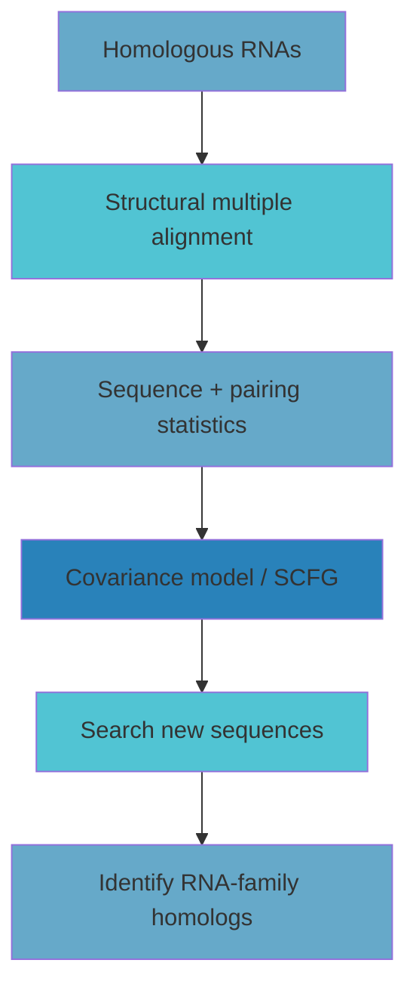
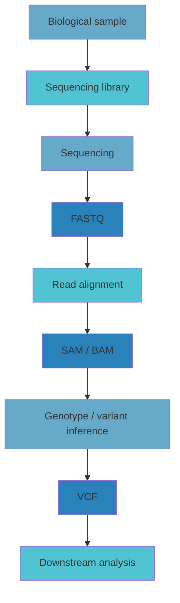

## RNA Covariation and Mutual Information {#rna-covariation}

Functional RNA often preserves ==**structure rather than exact sequence**==.

A base pair may change during evolution while maintaining pairing compatibility:

```text
C-G → U-G → U-A
```

The nucleotides change, but the stem can remain intact. Such coordinated changes are called **compensating mutations**, and the resulting pattern across homologous sequences is called **covariation**.

::: note
For structured RNA, strong biological conservation does not necessarily mean that each column in a multiple sequence alignment is individually conserved. Two variable columns can still be strongly constrained if they vary together.
:::

### Mutual information {#mutual-information}

Mutual information measures statistical dependence between two alignment columns $i$ and $j$:

$$
M_{ij}
=
\sum_{a,b\in B}
p_{ab,ij}
\log
\frac{p_{ab,ij}}
{p_{a,i}p_{b,j}},
\qquad
B=\{A,C,G,U\}.
$$

Here:

- $p_{a,i}$ is the frequency of nucleotide $a$ at position $i$;
- $p_{b,j}$ is the frequency of nucleotide $b$ at position $j$;
- $p_{ab,ij}$ is the joint frequency of observing $a$ at $i$ and $b$ at $j$.

If the two positions are independent,

$$
p_{ab,ij}\approx p_{a,i}p_{b,j},
$$

so the log-ratio approaches zero and the mutual information is low.

If the state of one position strongly predicts the state of the other, the mutual information becomes high.

### Conservation is not the same as dependence {#conservation-vs-dependence}

Consider two paired columns.

```text
Scenario A

i   j
A   U
C   G
G   C
U   A
```

Both columns are variable, but there is a strict relationship between them. Knowing the base at $i$ predicts the base at $j$, so mutual information is high.

Now consider:

```text
Scenario B

i   j
A   U
A   U
G   U
G   U
```

Column $j$ is completely conserved, but it does not depend on column $i$. Its state is always $U$, so the covariance signal is weak.

==**Mutual information measures dependence, not simple conservation.**==

---

## Structural Alignment and Covariance Models {#structural-alignment}

Covariation can only be detected if homologous positions are aligned correctly.

Two broad approaches are used:

| Alignment strategy | Main feature |
| --- | --- |
| Sequence-based alignment | Faster, relies mainly on sequence similarity |
| Structure-based alignment | Slower, incorporates conserved RNA structure |

High-quality RNA family alignments often require manual curation because sequence similarity alone may not preserve the correct structural correspondence.

### From alignment to model {#alignment-to-model}

Once a structural alignment is available, it can be used to train a probabilistic model.

A simple sequence profile models individual positions:

$$
P(x_i).
$$

A covariance model additionally represents dependencies between paired positions:

$$
P(x_i,x_j).
$$

This is the key distinction.

A sequence profile may learn that a given position prefers $A$ or $G$. A covariance model can additionally learn that two positions prefer combinations such as:

```text
A-U
G-C
G-U
```

while penalizing combinations inconsistent with the conserved RNA structure.

::: note
A covariance model can be viewed as an RNA family model that combines ==**sequence preferences + secondary-structure dependencies**==.
:::

### SCFGs and RNA homology search {#scfg-homology-search}

Structured RNA models are commonly formulated using **stochastic context-free grammars (SCFGs)**.

The overall workflow is:



This allows homology detection even when exact sequence conservation is weak but structural constraints remain strong.

---

## Infernal and Rfam {#infernal-rfam}

A full covariance-model search is computationally expensive.

Modern **Infernal** therefore uses a fast pre-filtering stage, typically based on an HMM, before applying the more expensive covariance model to promising regions.

The logic is similar to many other bioinformatics search pipelines:

```text
fast coarse search
        ↓
candidate regions
        ↓
slow accurate model
```

For structured RNA:

```text
HMM pre-filter
      ↓
candidate regions
      ↓
covariance model
```

**Rfam** provides curated structural RNA families that can be used as prior knowledge for RNA homology search.

::: note
The important conceptual transition is:

**multiple alignment → covariation → probabilistic structural model → homology search**
:::

---

## From RNA Models to NGS Data {#ngs-transition}

The second part of the week moved from RNA family modelling to practical **next-generation sequencing (NGS)** workflows.

The central pipeline is:



The main file types correspond to different stages of the analysis:

| Stage | Main file type | What it contains |
| --- | --- | --- |
| Raw sequence data | FASTQ | Reads and per-base qualities |
| Mapped reads | SAM/BAM | Read alignments to a reference |
| Variant information | VCF | Variants and genotype-related information |

---

## Ancient DNA as a Special NGS Case {#ancient-dna}

Ancient DNA is a useful example because it combines many common NGS problems in an extreme form.

Typical properties include:

- short DNA fragments;
- low endogenous DNA content;
- post-mortem damage;
- contamination risk;
- limited library complexity;
- potentially high clonality.

### DNA degradation and deamination {#dna-damage}

DNA fragments become shorter after death because the backbone breaks down over time.

A characteristic chemical change is cytosine deamination:

$$
C \rightarrow U.
$$

During sequencing, this often appears as:

$$
C \rightarrow T
$$

and, on the complementary strand,

$$
G \rightarrow A.
$$

Damage is therefore both a source of error and a possible signature of authentic ancient DNA.

::: note
In ancient-DNA analysis, a technical artifact can also carry biological information: characteristic terminal damage patterns can help distinguish ancient molecules from modern contamination.
:::

---

## Sequencing Libraries, Complexity, and Clonality {#library-complexity}

A sequencing library is a collection of DNA fragments prepared for sequencing.

**Library complexity** describes how many distinct original molecules are present.

A high-complexity library contains many unique fragments:

```text
A B C D E F G H ...
```

A highly clonal library may contain many copies of only a few original fragments:

```text
AAAA BBBBBB CCCCC DDD ...
```

Therefore,

$$
\text{more reads} \neq \text{more independent molecules}.
$$

Once the available molecular diversity has been exhausted, deeper sequencing mainly generates duplicates.

==**Library complexity determines the maximum amount of new information that can be recovered from a sample.**==

---

## FASTA and FASTQ {#fasta-fastq}

### FASTA {#fasta}

FASTA stores sequences:

```text
>sequence_id
ACGTACGTACGT
```

An identifier begins with `>`, followed by one or more sequence lines.

A FASTA file can contain multiple entries.

### FASTQ {#fastq}

FASTQ stores both the read sequence and a quality value for every base:

```text
@read_id
ACGTACGTACGT
+
IIIIHGFEDCBA
```

Each read normally occupies four lines:

1. read identifier;
2. nucleotide sequence;
3. separator line;
4. encoded quality string.

The important distinction is:

```text
FASTA → sequence
FASTQ → sequence + uncertainty
```

---

## Phred Quality Scores {#phred}

Per-base sequencing uncertainty is represented with a **Phred quality score**:

$$
Q=-10\log_{10}(\epsilon),
$$

where

$$
\epsilon=P(\text{base call is incorrect}).
$$

Equivalently,

$$
\epsilon=10^{-Q/10}.
$$

Common values are:

| Phred score | Error probability |
| ---: | ---: |
| Q10 | 10% |
| Q20 | 1% |
| Q30 | 0.1% |
| Q40 | 0.01% |

FASTQ usually encodes the numeric Q score as an ASCII character, commonly using an offset of 33.

---

## Read Alignment and Mapping Quality {#read-alignment}

After sequencing, reads are usually aligned to a reference genome.

Common aligners include:

- Bowtie;
- BWA;
- MAQ;
- SOAP2;
- Mosaik;
- Eland;
- DRAGEN.

An alignment record contains more than the read sequence. It can also include:

- reference chromosome;
- genomic position;
- strand;
- number of mismatches;
- alternative mapping information;
- mapping quality.

### Base quality vs mapping quality {#base-vs-mapq}

These represent two different uncertainties.

#### Base quality

How likely is a nucleotide call to be wrong?

$$
P(\text{base call is wrong})
$$

#### Mapping quality

How likely is the chosen genomic alignment to be wrong?

$$
P(\text{mapping is wrong})
$$

A read can therefore have excellent base qualities but poor mapping quality, for example when it comes from a repetitive region.

==**Base quality describes sequence uncertainty; mapping quality describes location uncertainty.**==

---

## SAM and BAM {#sam-bam}

SAM is a text alignment format. BAM is its binary representation.

Important SAM fields include:

| Field | Meaning |
| --- | --- |
| `QNAME` | Read identifier |
| `FLAG` | Alignment flags |
| `RNAME` | Reference name |
| `POS` | Leftmost mapped position |
| `MAPQ` | Mapping quality |
| `CIGAR` | Alignment operations |
| `RNEXT` | Mate reference |
| `RPOS` | Mate position |
| `ISIZE` | Inferred insert size |
| `SEQ` | Read sequence |
| `QUAL` | Base qualities |

### CIGAR {#cigar}

The `CIGAR` string describes how a read aligns to the reference.

A simple example:

```text
10M
```

indicates ten aligned positions.

More complex CIGAR strings can describe insertions, deletions, and clipping.

---

## Depth, Counts, and Coverage {#depth-coverage}

The course uses the following definitions:

- **Depth**: number of reads mapping to a genomic position;
- **Counts**: number of different alleles observed at a position;
- **Coverage**: fraction of a genome or region with data.

For a single position:

```text
read 1  --------
read 2  --------
read 3  --------
read 4  --------
             ^
           site
```

the depth at that site is four.

::: note
The literature is not fully consistent in its terminology. Phrases such as “30× coverage” are often used to mean average depth rather than the fraction of the genome covered.
:::

---

## Depth as a Sampling Process {#poisson-depth}

If reads are sampled approximately randomly across the genome, site depth can be modelled approximately by a Poisson distribution:

$$
D\sim\operatorname{Poisson}(\lambda),
$$

where $\lambda$ is the mean depth.

Thus,

$$
\lambda=8
$$

does not imply that every position has depth 8.

Instead, individual sites may have:

```text
site 1 → 3
site 2 → 10
site 3 → 0
site 4 → 7
site 5 → 14
```

This explains why a relatively high mean depth may still leave some positions uncovered.

---

## Alleles, Genotypes, and Genotype Calling {#genotype-calling}

An **allele** is an alternative state at a locus.

A **genotype** is the set of alleles carried by an individual at that locus.

In sequencing data, genotype is not directly observed. What we observe are reads sampled from chromosomes.

For example:

```text
A
A
A
G
G
A
G
```

does not automatically prove a heterozygous `A/G` genotype because the data are affected by:

- sequencing error;
- base quality;
- mapping quality;
- finite depth;
- sampling variation.

The inference problem can be expressed as:

$$
P(G\mid D),
$$

where $G$ is the underlying genotype and $D$ is the observed sequencing data.

A typical workflow is:

```text
reads
  ↓
genotype likelihoods
  ↓
genotype probabilities
  ↓
genotype calls
```

This is another example of a hidden biological state being inferred from noisy observations.

---

## VCF and Variant Representation {#vcf}

Variant Call Format (VCF) stores variant information inferred from mapped sequencing data.

The high-level transformation is:

```text
FASTQ
raw reads + base qualities
        ↓
alignment
        ↓
SAM/BAM
mapped reads + alignment information
        ↓
variant/genotype inference
        ↓
VCF
variants and genotypes
```

The files therefore represent progressively more interpreted forms of the same underlying biological sample.

---

## A Common Statistical Theme {#common-theme}

Although RNA covariance analysis and NGS processing appear to be different topics, they share the same statistical logic.

For RNA:

```text
multiple sequence alignment
        ↓
covariation
        ↓
mutual information / covariance model
        ↓
RNA structure or family membership
```

For NGS:

```text
sequencing reads
        ↓
quality + mapping + depth
        ↓
genotype likelihood
        ↓
genotype / variant inference
```

Both workflows have the form:

$$
\text{observed data}
\rightarrow
\text{statistical model}
\rightarrow
\text{biological inference}.
$$

The observed sequence data are not the final biological answer. They are evidence from which a hidden biological state must be reconstructed.

==**Biological sequence analysis is therefore not only about comparing strings; it is about modelling uncertainty, dependencies, and biological constraints in sequence data.**==

---

## Exam Checklist {#exam-checklist}

::: steps

1. Explain why RNA structure can be conserved even when sequence is not.
2. Define compensating mutations and covariation.
3. Explain what mutual information measures.
4. Distinguish mutual information from simple sequence conservation.
5. Explain why structural alignment is important.
6. Describe the difference between a sequence profile and a covariance model.
7. Explain the role of SCFGs, Infernal, and Rfam in RNA homology search.
8. Describe the overall NGS workflow from sample to VCF.
9. Explain why ancient DNA is short, damaged, and contamination-prone.
10. Distinguish library complexity from clonality.
11. Compare FASTA and FASTQ.
12. Convert between Phred score and sequencing error probability.
13. Distinguish base quality from mapping quality.
14. Name the most important SAM fields.
15. Distinguish depth, counts, and coverage.
16. Explain why depth can be approximated by a Poisson distribution.
17. Define allele, genotype, and genotype calling.
18. Explain why genotype is inferred rather than directly observed in sequencing data.

:::
