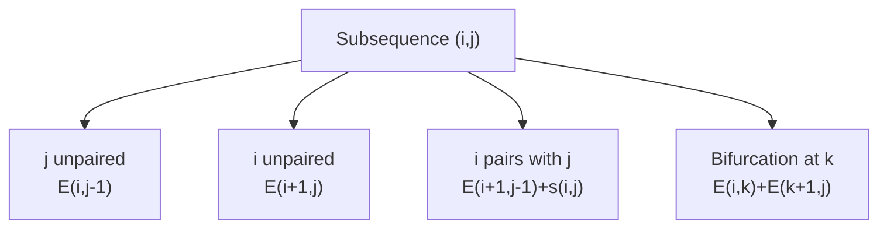

## RNA Structure and Function {#rna-structure-and-function}

RNA molecules are not only intermediates in protein synthesis. Many RNAs have ==**structural, catalytic, and regulatory functions**==, and these functions often strongly depend on their structure.

RNA structure can be considered at three levels:

- **1D structure**: the nucleotide sequence.
- **2D structure**: the secondary structure, mainly determined by base pairing.
- **3D structure**: the complete spatial conformation of the RNA molecule.

A particularly important principle for ncRNAs is that ==**RNA structure may be evolutionarily conserved even when the primary sequence is not**==.

This means that, for structured RNAs, sequence similarity alone may not be sufficient to identify homologous molecules.

## RNA Secondary Structure {#rna-secondary-structure}

RNA secondary structure is formed mainly by intramolecular base pairing. Important structural elements include:

- **Stem / Duplex**: consecutive paired bases.
- **Hairpin loop**: a stem terminated by a loop of unpaired nucleotides.
- **Internal loop**: unpaired nucleotides on both sides between two paired regions.
- **Bulge**: unpaired nucleotides on only one side of a stem.
- **Junction / Multiloop**: a branching point connecting multiple stems.
- **Single-stranded region**: nucleotides not involved in base pairing.

Formally, an RNA secondary structure can be represented as a set of base pairs $(i,j)$,where nucleotide $i$ is paired with nucleotide $j$.

A valid secondary structure satisfies two important constraints:

1. ==**A nucleotide can participate in at most one base pair**==.
2. ==**Base pairs cannot cross**==.

For two base pairs $(i,j)$ and $(k,l)$, the configuration $i < k < j < l$ is therefore not permitted in the standard secondary-structure model.

The base pairs normally considered are `GC`,`CG`,`AU`,`UA`,`GU`,`UG`.

The `GU` pair is known as a **wobble pair**.

::: note
The restriction against crossing base pairs means that standard RNA secondary-structure algorithms usually exclude **pseudoknots**.
:::

## Pseudoknots {#pseudoknots}

A **pseudoknot** occurs when base pairs cross in the secondary-structure representation.

Pseudoknots are commonly excluded from basic folding models because:

- excluding them greatly simplifies the mathematical model;
- dynamic programming algorithms become much simpler;
- many possible pseudoknot structures are sterically infeasible;
- their energetic parameters are less well characterized.

However, pseudoknots can still be biologically important and may contribute to tertiary RNA structure. Some classes, such as **H-type pseudoknots**, can be handled with additional computational effort.

Therefore:

$$
\boxed{\text{Computational convenience} \neq \text{biological irrelevance}}
$$

## Why Consider RNA Secondary Structure? {#why-rna-secondary-structure}

Secondary structure is particularly useful because it is a ==**biologically meaningful coarse-grained representation of RNA 3D structure**==.

Important reasons for studying secondary structure include:

- it captures a large fraction of the free energy associated with folding;
- it represents an intermediate toward the full 3D structure;
- functional secondary structures can be conserved during evolution;
- it is computationally much easier to model than full 3D structure.

Thus, secondary structure provides a useful compromise between biological realism and computational tractability.

## Examples of Functional ncRNAs {#functional-ncrnas}

RNA molecules have many different biological functions.

### rRNA {#rrna}

**Ribosomal RNA (rRNA)** is a major structural and functional component of the ribosome.

Important properties include:

- the ribosome contains a **large** and a **small** subunit;
- rRNA interacts with both **mRNA** and **tRNA**;
- the ribosome is a ==**ribozyme**==, meaning that RNA contributes directly to catalytic activity;
- translation can also be regulated through ribosomal mechanisms.

### SRP RNA {#srp-rna}

The **Signal Recognition Particle (SRP)** is an RNA-protein complex involved in targeting proteins to membranes.

Its major functions include:

- binding signal peptides;
- interacting with the SRP receptor at the ER membrane;
- using its large domain for signal-peptide recognition;
- using its small domain in translation regulation.

### RNase P RNA {#rnase-p-rna}

**RNase P** processes precursor tRNAs by removing their $5'$ leader sequences.

In bacteria, the RNA component of RNase P is itself ==**catalytically active**==.

Therefore, bacterial RNase P RNA is another example of a **ribozyme**.

### tmRNA {#tmrna}

**tmRNA**, previously known as 10S RNA, combines properties of both tRNA and mRNA.

Its main function is to rescue bacterial ribosomes that reach the $3'$ end of an mRNA lacking a stop codon.

Thus, tmRNA acts as a quality-control mechanism during translation.

## Small Nucleolar RNA {#snorna}

**Small nucleolar RNAs (snoRNAs)** are generally approximately $60$--$300$ nucleotides long and participate primarily in rRNA maturation.

Two major snoRNA classes are:

::: table align="center" copy="all"
| snoRNA class | Main function |
| :---: | :---: |
| **Box C/D** | $2'$-O-methylation |
| **Box H/ACA** | Pseudouridylation $(\Psi)$ |
:::

snoRNAs generally:

- act in a site-specific manner;
- associate with proteins to form **snoRNPs**;
- function as guide RNAs;
- are often encoded within introns.

Computational methods such as ==**Hidden Markov Models (HMMs)**== and ==**Stochastic Context-Free Grammars (SCFGs)**== can be used to identify snoRNAs.

## MicroRNAs {#micrornas}

**MicroRNAs (miRNAs)** are small regulatory RNAs, typically approximately $20$--$24$ nucleotides long.

They are commonly generated from approximately $70$ nt stem-loop precursors.

The canonical miRNA processing pathway can be summarized as

$$
\text{miRNA gene}
\rightarrow
\text{pri-miRNA}
\rightarrow
\text{pre-miRNA}
\rightarrow
\text{miRNA/miRNA* duplex}
\rightarrow
\text{RISC}.
$$

Important components include:

- **Drosha**, which processes the pri-miRNA;
- **Exportin-5**, which transports pre-miRNA to the cytoplasm;
- **Dicer**, which processes the precursor further;
- **Argonaute (Ago)** proteins;
- the **RNA-induced silencing complex (RISC)**.

miRNAs regulate biological processes including:

- development;
- metabolism;
- growth;
- stress response;
- cell death.

They may also be involved in disease processes such as cancer.

::: note
Not all miRNAs necessarily follow the canonical pathway. Alternative pathways include **mirtrons** and miRNAs derived from other structured RNAs.
:::

## Long Non-coding RNAs {#lncrnas}

**Long non-coding RNAs (lncRNAs)** are a highly diverse class of RNAs with complex gene structures and functional domains.

Different regions of an lncRNA may interact with:

- RNA;
- proteins;
- DNA.

Therefore, lncRNAs may function as:

- **scaffolds**;
- **guides**;
- **interaction platforms**;
- **conformational switches**.

A substantial fraction of lncRNAs also contains sequences derived from **transposable elements**.

One particular class discussed in the lecture is **chromatin-enriched lncRNAs (cheRNAs)**, which can contribute to activation of nearby genes.

## Representations of RNA Secondary Structure {#rna-structure-representations}

The same RNA secondary structure can be represented in several different ways.

Common representations include:

1. **Secondary-structure diagram**  
   Directly shows stems, loops, bulges, and junctions.

2. **Circle plot**  
   Nucleotides are arranged around a circle and base pairs are represented as arcs.

3. **Mountain plot**  
   Represents the nesting depth of base pairs along the sequence.

4. **Parenthesis / Dot-bracket representation**  
   Encodes base pairing using characters.

For example,

```text
(((...)))
```

represents three nested base pairs surrounding three unpaired nucleotides.

In dot-bracket notation:

- `(` and `)` represent paired nucleotides;
- `.` represents an unpaired nucleotide.

## RNA Structural Ensembles {#rna-structural-ensembles}

An RNA molecule should not necessarily be considered to have only one possible structure.

At thermodynamic equilibrium, an RNA can occupy an ==**ensemble of different structures**==.

The probability that nucleotides $i$ and $j$ form a pair can be written as

$$
p_{ij}.
$$

These probabilities can be represented using a **dot plot**, where the size of a square corresponds to the probability of the corresponding base pair.

Therefore, a dot plot contains information about the ==**entire structural ensemble and the uncertainty of individual base pairs**==.

This differs fundamentally from a single predicted minimum-free-energy structure.

$$
\boxed{\text{MFE structure} \neq \text{complete structural ensemble}}
$$

## Loop Decomposition {#loop-decomposition}

An RNA secondary structure can be uniquely decomposed into loops.

Important loop types include:

- **stacking pairs**;
- **hairpin loops**;
- **internal loops**;
- **bulges**;
- **multiloops**;
- **exterior loops**.

This decomposition is particularly important because modern RNA-folding energy models calculate the total energy mainly from ==**loop contributions rather than independent base-pair scores**==.

## Thermodynamics of RNA Folding {#rna-folding-thermodynamics}

The free energy of an RNA secondary structure is approximately modeled as the sum of the energies of its individual loops:

$$
\Delta G(S)
\approx
\sum_{L \in S} \Delta G(L).
$$

The energy associated with a loop depends on factors including:

- loop type;
- loop size;
- sequence context.

Most important parameters are experimentally measured, although some parameters still have to be estimated.

### Measuring Folding Parameters {#measuring-folding-parameters}

Thermodynamic folding parameters are mainly obtained from **melting experiments on oligonucleotides**.

Typically, UV absorbance is measured as a function of temperature.

The resulting experimental measurements are used to estimate free-energy parameters, commonly reported around $37^\circ\text{C}$.

Not all possible structural configurations have been experimentally measured. Missing parameters may therefore be:

- estimated from related measurements;
- optimized to improve structure-prediction accuracy.

## Stacked Base Pairs {#stacked-base-pairs}

==**Base-pair stacking is one of the major stabilizing energetic contributions in RNA secondary structure**==.

The energetic contribution of a base pair does not depend only on the identities of the two nucleotides forming that pair. It also depends on neighboring base pairs.

Thus,

$$
\text{energy of a base pair}
\neq
\text{constant determined only by pair type}.
$$

Instead, local structural context matters.

This is the basis of the **nearest-neighbor model** used in thermodynamic RNA folding.

Some configurations, such as tandem $GU$ pairs, can show additional context dependence and may violate a simple nearest-neighbor approximation.

## Minimum Free Energy Folding {#minimum-free-energy-folding}

One common approach to RNA structure prediction is to find the structure with the ==**minimum free energy (MFE)**==.

Formally,

$$
S_{\mathrm{MFE}}
=
\underset{S}{\operatorname{argmin}}
\ \Delta G(S).
$$

The predicted structure is therefore the secondary structure with the lowest free energy according to the chosen thermodynamic model.

Advantages of MFE prediction include:

- it is relatively straightforward to calculate;
- it returns one easy-to-interpret structure;
- it incorporates realistic thermodynamic parameters.

However, MFE folding has several limitations:

- it returns only one structure rather than the complete equilibrium ensemble;
- it gives no direct indication of prediction reliability;
- thermodynamic parameters are imperfect;
- the energy model itself contains approximations;
- prediction accuracy generally decreases for longer RNA sequences.

The lecture gives an approximate prediction accuracy of ==**40--70%**== with current parameters.

Furthermore, biologically correct structures can sometimes occur within a small energy difference from the predicted MFE structure.

## Finding ncRNAs by Folding Single Sequences {#single-sequence-ncrna-search}

A seemingly straightforward strategy for identifying structured ncRNAs in a genome would be:

::: steps

1. Slide a window along the genome.
2. Fold each sequence.
3. Find unusually stable predicted structures.
:::

However, this strategy generally ==**does not work well**==.

The main reason is that random RNA sequences can also form apparently stable secondary structures.

Therefore,

$$
\boxed{
\text{Stable predicted structure}
\not\Rightarrow
\text{functional ncRNA}
}
$$

Real ncRNAs are therefore often difficult to distinguish from random sequences using only single-sequence folding.

## Structural Conservation {#rna-structural-conservation}

For homologous RNAs, structure can remain conserved even when sequence changes.

For example, a paired position may evolve as

$$
C-G
\rightarrow
U-G
\rightarrow
U-A.
$$

Although the nucleotide identities change, the ability to form a pair is maintained.

Such changes provide evidence of ==**structural conservation**==.

This leads to an important principle:

$$
\boxed{
\text{For structured RNAs, structure can be more conserved than sequence}
}
$$

Therefore, comparative sequence analysis is often more useful than folding isolated sequences when searching for functional ncRNAs.

## RNA Structure Motif Search {#rna-structure-motif-search}

A conserved RNA family may have little obvious primary-sequence conservation while maintaining a common secondary structure.

The Iron Responsive Element (**IRE**) example illustrates this problem.

When several sequences are compared only at the sequence level, the shared motif may be difficult to recognize. After structural alignment, however, a common stem-loop structure becomes apparent.

Thus, for many ncRNAs:

$$
\text{search object}
=
\text{sequence} + \text{structure}.
$$

This motivates structure-aware RNA homology-search methods.

## Rfam {#rfam}

**Rfam** is a database of structural RNA families.

It contains RNA families including:

- ncRNA genes;
- structural regulatory elements;
- self-splicing introns.

Rfam families are based on manually curated **seed alignments**.

The database uses **Infernal** to search sequence databases for homologous RNAs.

The essential idea is that Infernal can incorporate both ==**sequence conservation and RNA secondary-structure conservation**==, making it substantially more suitable for structured RNA homology search than ordinary sequence-only methods.

## Dynamic Programming for RNA Folding {#dynamic-programming-rna-folding}

RNA folding can also be formulated as a **dynamic programming problem**.

The general idea is the same as for pairwise alignment:

> Solve small optimal subproblems first and combine them to obtain optimal solutions for larger problems.

For RNA folding, however, the subproblem is not defined by prefixes of two sequences. Instead, it is defined by an interval within a single RNA sequence:

$$
x_i, \ldots, x_j.
$$

A dynamic-programming matrix can therefore store the optimal structure score for every subsequence $(i,j)$.

## Nussinov Algorithm {#nussinov-algorithm}

The **Nussinov algorithm** is a simple dynamic-programming algorithm for RNA secondary-structure prediction.

Its objective is to

$$
\boxed{\text{maximize the number of valid base pairs}}
$$

rather than minimize thermodynamic free energy.

Although this is a biologically incomplete model, it introduces the main dynamic-programming concepts used in more advanced RNA-folding algorithms.

### Dynamic Programming State {#nussinov-state}

Define

$$
E(i,j)
$$

as the ==**maximum number of base pairs that can be formed in the subsequence from position $i$ to position $j$**==.

For each subsequence, several possibilities must be considered.

### Nussinov Recurrence {#nussinov-recurrence}

The recurrence relation is

$$
E(i,j)=
\max
\begin{cases}
E(i,j-1),\\
E(i+1,j),\\
E(i+1,j-1)+s(i,j),\\
\displaystyle\max_{i<k<j-1}
\left\{
E(i,k)+E(k+1,j)
\right\}.
\end{cases}
$$

where

$$
s(i,j)=
\begin{cases}
1, & \text{if } x_i \text{ and } x_j \text{ can pair},\\
0, & \text{otherwise}.
\end{cases}
$$

Each term has a structural interpretation:

1. $E(i,j-1)$: nucleotide $j$ remains unpaired.
2. $E(i+1,j)$: nucleotide $i$ remains unpaired.
3. $E(i+1,j-1)+s(i,j)$: nucleotides $i$ and $j$ pair.
4. $E(i,k)+E(k+1,j)$: the structure is divided into two independent substructures.

The final case is known as ==**bifurcation**==.



### Minimum Loop Length {#minimum-loop-length}

Not every complementary pair can necessarily form a physically meaningful hairpin.

A minimum number of nucleotides between paired positions can therefore be required.

For example, if the minimum loop length is $h$, pairing may only be permitted when

$$
j-i > h.
$$

This prevents unrealistically small hairpin loops.

### Complexity Analysis {#nussinov-complexity}

For an RNA sequence of length $N$, the Nussinov algorithm has

$$
\boxed{\text{Time complexity} = O(N^3)}
$$

and

$$
\boxed{\text{Space complexity} = O(N^2)}.
$$

The $O(N^2)$ memory comes from storing one value for each interval $(i,j)$.

The cubic running time mainly results from the bifurcation term because, for each of the $O(N^2)$ intervals, the algorithm may test $O(N)$ possible split points $k$.

## Nussinov vs. Minimum Free Energy Folding {#nussinov-vs-mfe}

The Nussinov model assumes that

$$
\text{more base pairs}
\Longrightarrow
\text{better structure}.
$$

This is too simplistic for real RNA molecules.

Actual RNA stability depends on:

- base-pair identity;
- stacking;
- hairpin-loop energy;
- internal-loop energy;
- bulges;
- multiloops;
- local sequence context.

Therefore, modern thermodynamic RNA folding replaces the simple maximization objective with ==**free-energy minimization**==.

::: table align="center" copy="all"
| Property | Nussinov | MFE folding |
| :---: | :---: | :---: |
| Objective | Maximize number of base pairs | Minimize free energy |
| Score | Simple pairing score | Thermodynamic parameters |
| Loop energetics | Not realistically modeled | Explicitly modeled |
| Stacking | Not realistically modeled | Included |
| Biological realism | Low | Higher |
| Pseudoknots | Usually excluded | Usually excluded |
| Main purpose | Simple DP model | Practical structure prediction |
:::

The conceptual transition is therefore

$$
\boxed{
\text{maximize base pairs}
\quad\Longrightarrow\quad
\text{minimize free energy}
}
$$

## Relationship to Pairwise Alignment {#rna-folding-vs-alignment}

Needleman-Wunsch, Smith-Waterman, and Nussinov are all examples of ==**dynamic programming**==.

Their common principle is **optimal substructure**:

> An optimal solution to a large problem can be constructed from optimal solutions to smaller subproblems.

For pairwise alignment,

$$
F(i,j)
$$

describes an optimal alignment involving two sequences.

For Nussinov RNA folding,

$$
E(i,j)
$$

describes an optimal secondary structure within one subsequence.

The underlying dynamic-programming philosophy is therefore similar, but the biological objects and recurrence relations are different.

## Key Concepts for RNA Structure and Folding {#rna-key-concepts}

For the exam, the most important points are:

- RNA function can depend critically on ==**secondary structure**==.
- Important RNA structural elements include stems, hairpins, bulges, internal loops, and multiloops.
- A nucleotide can form at most one base pair in the standard secondary-structure model.
- Crossing base pairs are excluded, so standard models usually do not contain **pseudoknots**.
- Common allowed pairs are $AU$, $UA$, $GC$, $CG$, $GU$, and $UG$.
- RNA secondary structure provides a useful coarse-grained representation of 3D structure.
- Functional RNAs include rRNA, SRP RNA, RNase P RNA, tmRNA, snoRNA, miRNA, and lncRNA.
- A **dot plot** represents base-pair probabilities in a structural ensemble.
- RNA folding energy is approximated as a sum of **loop energies**.
- **Base stacking** is a major source of structural stabilization.
- MFE folding identifies the structure with the ==**minimum predicted free energy**==.
- The MFE structure is only one member of the thermodynamic ensemble.
- Stable predicted folding alone is insufficient to distinguish functional ncRNAs from random sequences.
- RNA structure can remain conserved even when sequence identity is low.
- Comparative structural information is therefore useful for detecting ncRNA homologues.
- **Rfam** groups RNAs into structural families, while **Infernal** performs structure-aware homology search.
- The **Nussinov algorithm** predicts RNA secondary structure by maximizing the number of base pairs.
- Nussinov uses $O(N^3)$ time and $O(N^2)$ memory.
- Nussinov is biologically incomplete because ==**maximum base pairing is not equivalent to minimum free energy**==.
