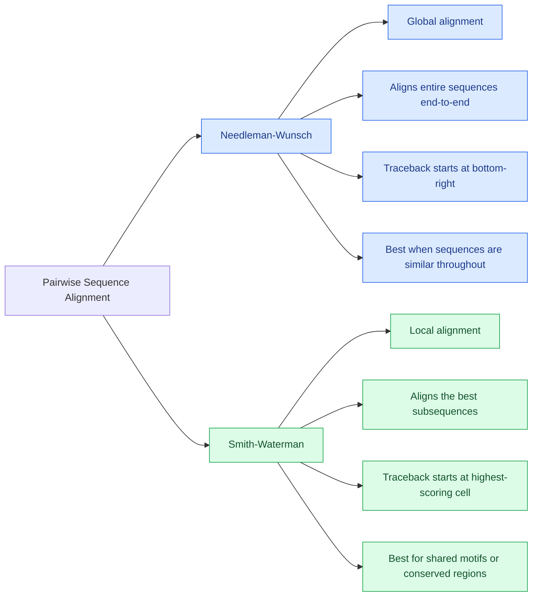

## Week 01 - Pairwise Alignment {#pairwise-alignment}

### Core Mathematical Concepts {#core-mathematical-concepts}

- **==Alphabet==**: Set of allowed symbols, for example, in DNA sequences, the alphabet is `{A, C, G, T}`.
- **==Probability==**: $0 \leqslant P \leqslant 1$, probability is a measure of the likelihood of an event occurring. The sum of probabilities of all possible events equals 1.
- **==Independent Events==**: Two events A and B are independent if the occurrence of one does not affect the probability of the other. Mathematically, $P(A \cap B) = P(A) \cdot P(B)$.
- **==Joint Probability==**: The probability of two events A and B occurring together, denoted as $P(A, B) = P(A | B) \cdot P(B)$.
- **==Marginal Probability==**: The probability of an event occurring regardless of the outcome of another event, denoted as $P(A) = \sum_{i} P(A, b_i)$.
- **==Bayes' Theorem==**: A fundamental theorem in probability theory that describes the probability of an event based on prior knowledge of conditions related to the event. It is expressed as
  $$
  P(A | B) = \frac{P(B | A) \cdot P(A)}{P(B)}.
  $$
- Algorithmic complexity describes how running time or memory grows with input size.

### Basics of pairwise sequence alignment {#basics-of-pairwise-sequence-alignment}

- Goal: To find the best alignment between two sequences, which can be DNA, RNA, or protein sequences.
- Main problem: The number of possible alignments grows extremely rapidly, so exhaustive enumeration is impractical.
- Instead, dynamic programming is used to find the optimal alignment efficiently, by constructing larger optimal solutions from smaller optimal solutions.

### Needleman-Wunsch Algorithm {#needleman-wunsch-algorithm}

#### Background {#nwa-background}

The Needleman-Wunsch algorithm is a dynamic programming algorithm used for ==**global**== sequence alignment. It was developed by Saul Needleman and Christian Wunsch in 1970. The algorithm finds the optimal alignment between two sequences by filling a matrix and backtracking to find the actual alignment.

It aligns two sequences ==**end-to-end**==, meaning it considers the entire length of both sequences. The algorithm uses a scoring system that assigns scores for matches, mismatches, and gaps (insertions or deletions). The goal is to maximize the overall alignment score.

The algorithm is appropriate ==when sequenses are expected to be similar over their entire length==, such as when comparing homologous genes or proteins.

#### Algorithm Steps {#nwa-steps}

The algorithm uses the following dynamic programming recurrence relation to fill the scoring matrix:

$$
F(i, j) = \max \begin{cases}
F(i - 1, j) + g_{\text{gap}}, \\
F(i, j - 1) + g_{\text{gap}}, \\
F(i - 1, j - 1) + s(x_i, y_j).
\end{cases} , g_{\text{gap}} \leqslant 0.
$$

In this relation, $F(i, j)$ represents the optimal alignment score for the first $i$ characters of sequence $X$ and the first $j$ characters of sequence $Y$. The function $s(x_i, y_j)$ returns the score for aligning character $x_i$ from sequence $X$ with character $y_j$ from sequence $Y$. The gap penalty $g_{\text{gap}}$ is a negative value that penalizes gaps in the alignment.

To implement the Needleman-Wunsch algorithm, there are three main steps:

::: steps

1. **Initialization**: Create a scoring matrix $F \in \mathbb{R}^{(m+1) \times (n+1)}$, where $m = |X|$ and $n = |Y|$ are the lengths of the two sequences. Initialize its boundaries using the gap penalty:
   $$
   F(0,0)=0, \qquad F(i,0)=i\,g_{\text{gap}}, \qquad F(0,j)=j\,g_{\text{gap}}.
   $$
2. **Matrix Filling**: Fill in the scoring matrix using the recurrence relation, considering matches, mismatches, and gaps.
3. **Backtracking**: Starting from the bottom-right cell of the matrix, trace back to the top-left cell to find the optimal alignment path, which represents the best alignment between the two sequences.
:::

::: note
To initiate the gap penalty,here's a simple formula:

$$
\begin{cases}
F(0, 0) = 0, \\
F(i, 0) = i \cdot g_{\text{gap}}, \\
F(0, j) = j \cdot g_{\text{gap}}.
\end{cases}
$$

:::

#### Complexity Analysis {#nwa-complexity}

The time complexity of the Needleman-Wunsch algorithm is $O(mn)$, where $m$ and $n$ are the lengths of the two sequences. The space complexity is also $O(mn)$ due to the storage of the scoring matrix. However, optimizations can be made to reduce space complexity to $O(\min(m, n))$ by only storing two rows or columns at a time.

### Smith-Waterman Algorithm {#smith-waterman-algorithm}

#### Background {#swa-background}

The Smith-Waterman algorithm is a dynamic programming algorithm used for ==**local**== sequence alignment. It was developed by Temple F. Smith and Michael S. Waterman in 1981. The algorithm finds the optimal local alignment between two sequences by filling a scoring matrix and backtracking to find the actual alignment.

It finds the best matching ==**subsequences**==, rather than aligning the entire sequences. The algorithm is useful for detecting shared domains, motifs, or conserved regions between sequences that may not be similar over their entire length (a.k.a. **divergent evolution**).

#### Algorithm Steps {#swa-steps}

The key modifation relative to the Needleman-Wunsch algorithm is the introduction of a zero in the recurrence relation, which allows for the possibility of starting a new alignment at any point in the sequences. The recurrence relation for the Smith-Waterman algorithm is as follows:

$$
  F(i, j) = \max \begin{cases}
  F(i - 1, j - 1) + s(x_i, y_j), \\
  F(i - 1, j) + g_{\text{gap}}, \\
  F(i, j - 1) + g_{\text{gap}}, \\
  0
  \end{cases}
$$

::: note
The matrix is initialized similarly to the Needleman-Wunsch algorithm, but with the first row and column set to zero:

$$
  F(0, j) = 0, \quad F(i, 0) = 0.
$$
:::

The traceback starts at the ==**highest-scoring cell**==, not necessarily the bottom-right cell, in the matrix and continues until a cell with a score of zero is reached. This allows for the identification of the best local alignment.

#### Complexity Analysis {#swa-complexity}

The time complexity of the Smith-Waterman algorithm is also $O(mn)$, where $m$ and $n$ are the lengths of the two sequences. The space complexity is $O(mn)$ due to the storage of the scoring matrix. Similar to Needleman-Wunsch, optimizations can be made to reduce space complexity to $O(\min(m, n))$ by only storing two rows or columns at a time.

### Alignment Scoring {#alignment-scoring}

The alignment quality mainly depends on the scoring system used, which includes ==**match scores, mismatch penalties, and gap penalties**==. The choice of scoring parameters can significantly affect the resulting alignment. 

For example, a large gap penalty may discourage gaps in the alignment, while a small gap penalty may allow for more gaps. Similarly, the match and mismatch scores can be adjusted based on the biological context of the sequences being aligned.

Therefore, ==**changing scoring parameters can change both the score and the resulting alignment**==. It is important to choose scoring parameters that are appropriate for the specific sequences being aligned and the biological question being addressed.

### Linear vs. Affine Gap Penalties {#linear-vs-affine-gap-penalties}

For gap penalties, there's a general idea: $g(k) = d + e (k-1)$, where $d$ is the penalty for opening a gap and $e$ is the penalty for extending it. We consider two types of gap penalties: linear and affine.

$$
  \begin{cases}
  g(k) = k \cdot g_{\text{gap}} & \text{Linear gap penalty} \\
  g(k) = g_{\text{gap}} + (k - 1) \cdot g_{\text{ext}} & \text{Affine gap penalty}
  \end{cases}
$$

For linear gap penalties, the penalty for a gap $g(k)$ of length $k$ is simply $k \cdot g_{\text{gap}}$, where $g_{\text{gap}}$ is the penalty for a single gap. This means that each additional gap incurs the same penalty.

For affine gap penalties, the penalty for a gap $g(k)$ of length $k$ is given by $g_{\text{gap}} + (k - 1) \cdot g_{\text{ext}}$, where $g_{\text{gap}}$ is the penalty for opening a gap and $g_{\text{ext}}$ is the penalty for extending it. This model accounts for the fact that opening a gap is more costly than extending it.

In general, gap opening is much more expensive than extending a existing gap, that is, in biological motivations, one long indel event is generally more plausible than many independent short indels. Therefore, affine gap penalties are often preferred in biological sequence alignment.

### Probabilistic Interpretion of Alignment Scores {#probabilistic-interpretation-of-alignment-scores}

Here are some formulas for the probabilistic interpretation of alignment scores:

1. Random model $R$:

$$
  P(X, Y | R) = \prod_{i} q_{x_i} \cdot \prod_{j} q_{y_j} = \prod_{i=1}^{m} P(x_i | R) \cdot \prod_{j=1}^{n} P(y_j | R)
$$

2. Match model $M$:

$$
  P(X, Y | M) = \prod_{i} p_{x_iy_i} = \prod_{i=1}^{m} P(x_i, y_i | M)
$$

3. Compare models using an odds ratio:

$$
  \frac{P(X, Y | M)}{P(X, Y | R)} = \prod_{i=1}^{m} \frac{P(x_i, y_i | M)}{P(x_i | R) \cdot P(y_i | R)}
$$

4. Taking logarithms converts the product into an additive alignment score:

$$
  S(X, Y) = \sum_{i}{s(x_i,y_i)} = \sum_{i=1}^{m} \log \frac{P(x_i, y_i | M)}{P(x_i | R) \cdot P(y_i | R)}
$$

5. Substitution scores can be defined as:

$$
  s(x, y) = \log \frac{p_{xy}}{q_x q_y} = \log \frac{P(x, y | M)}{P(x | R) \cdot P(y | R)}
$$

To summarize, a positive substitution score indicates that the aligned residues are more often to occur together than by chance, while a negative score suggests that they are less often to occur together.

### Substitution Matrices {#substitution-matrices}

Substitution matrices are derived from observed substitutions in conserved/local protein alignments. The scores are log-odds scores, which are calculated based on the observed frequencies of amino acid substitutions in a set of aligned sequences. The most commonly used substitution matrices are PAM (Point Accepted Mutation) and BLOSUM (BLOcks SUbstitution Matrix).

#### BLOSUM Matrices {#blosum-matrices}

BLOSUM matrices are derived from conserved regions of protein sequences, known as blocks. The BLOSUM matrices are constructed by analyzing the frequencies of amino acid substitutions in these blocks and calculating log-odds scores based on the observed substitution frequencies.

Two kinds of BLOSUM matrices commonly used:

- **BLOSUM62**: Derived from alignments of sequences with at least 62% identity. It is widely used for ==**general-purpose**== protein sequence alignment.
- **BLOSUM80**: Derived from alignments of sequences with at least 80% identity. It is more suitable for aligning ==**closely related sequences**==.

The higher BLOSUM number is, the more closely related the sequences are. 

For example, BLOSUM80 is used for aligning sequences that are more similar, while BLOSUM62 is used for aligning sequences that are more divergent.

#### PAM Matrices {#pam-matrices}

PAM matrices are derived from observed substitutions in closely related protein sequences. The scores are also log-odds scores, which are calculated based on the observed frequencies of amino acid substitutions in a set of aligned sequences. 

The most commonly used PAM matrices are PAM1 and PAM250.

- **PAM1**: Derived from alignments of sequences that have diverged by 1% (i.e., 1 accepted point mutation per 100 amino acids). It is suitable for aligning ==**very closely related sequences**==.
- **PAM250**: Derived from alignments of sequences that have diverged by 250% (i.e., 250 accepted point mutations per 100 amino acids). It is suitable for aligning ==**more distantly related sequences**==.

For example, PAM1 is used for aligning sequences that are very similar, while PAM250 is used for aligning sequences that are more divergent.

#### Summary of BLOSUM and PAM Matrices {#summary-of-blosum-and-pam-matrices}

PAM matrices were originally constructed from global alignments of closely related proteins. PAM1 represents a very small evolutionary distance, and matrices for larger distances are extrapolated from PAM1 using an evolutionary model. Therefore, a higher PAM number indicates a greater evolutionary distance and is generally used for more distantly related sequences.

BLOSUM matrices, in contrast, are constructed from conserved local alignment blocks and are based directly on observed amino acid substitutions. Their numbering follows the opposite trend from PAM: a higher BLOSUM number represents a smaller evolutionary distance and is more appropriate for closely related sequences, whereas a lower BLOSUM number is used for more divergent sequences.

The opposite numbering trends can be remembered as:

$$
\boxed{\text{PAM number } \uparrow \;\Longrightarrow\; \text{evolutionary distance } \uparrow}
$$

$$
\boxed{\text{BLOSUM number } \uparrow \;\Longrightarrow\; \text{evolutionary distance } \downarrow}
$$

### Sequence Identity and Similarity {#sequence-identity-and-similarity}

The sequence identity is the percentage of ==**identical residues**== in the aligned sequences, while sequence similarity takes into account ==**both identical and similar residues**== based on the scoring matrix used.

Identity has a straightforward definition; similarity depends on the scoring system/substitution matrix. Therefore, there's a relationship between the two: $\% \text{identity} \leqslant \% \text{similarity}$.

### Database Search {#database-search}

A question is why database search cannot simply use dynamic programming everywhere. The answer is that:

Comparing a query of length $l$ against a database length $L$ using full dynamic programming would cost approx. $O(lL)$. With huge sequence databases, performing optimal alignment against everything is computationally expensive. Therefore, **heuristic** methods are used to speed up the search process, such as ==**BLAST (Basic Local Alignment Search Tool)**== and ==**FASTA (Fast Alignment Search Tool)**==.

#### Main database-search strategy {#main-database-search-strategy}

One common strategy is to replace one difficult approximate-matching problem with many fast short-string searches. The main steps are:

::: steps
1. **Seed Generation**: Identify short, exact matches (seeds) between the query and database sequences. These seeds are typically k-mers (subsequences of length k) that are shared between the query and database sequences.
2. **Seed Extension**: Extend the seeds in both directions to find longer alignments.
3. **Scoring and Filtering**: Score the extended alignments using a scoring system (e.g., substitution matrix and gap penalties) and filter out low-scoring alignments.
4. **Final Alignment**: Perform a more detailed alignment (e.g., using dynamic programming) on the high-scoring alignments to obtain the final results.
:::

::: note
Long sequences that approx. match should normally contain short exact or high-scoring matching words. Therefore, if two strings of length $n$ differ by at most $d$ mismatches, they must share at least one exact word of approx.:

$$
  \left\lfloor \frac{n}{d+1} \right\rfloor
$$
:::

### k-mers & Words {#k-mers-and-words}

A k-mer is a substring of length $k$, and short words are used as **seeds* for finding potential alignments. There are some advantages as well as trade-offs in using k-mers:

::: flex center center
- Advantages:
  - Exact matching can be much faster than dynamic programming;
  - Only promising regions need expensive alignment calculations.

+ Trade-offs:
  + Shorter $k$ → more sensitive but many random matches;
  + Longer $k$ → more specific but can miss true matches.
:::

#### Hash Tables {#hash-tables}

You can map a key to a table position using a hash function.

A good hash function distributes keys approx. uniformly across the table, minimizing collisions, that is, two different keys mapping to the same table position. Collisions can be handled by storing multiple entries, e.g., using linked lists or open addressing.

With a suitably sized hash table and few collisions, average lookup can be approx. $O(1)$, which is much faster than searching through a list of keys.

#### Perfect Hasing of DNA k-mers {#perfect-hashing-of-dna-k-mers}

DNA alphabet has only 4 letters, so we can encode each letter as a 2-bit number:

::: flex center
| **Letter** | **Encoding** |
|:----------:|:------------:|
| A          | $(00)_2$     |
| C          | $(01)_2$     |
| G          | $(10)_2$     |
| T          | $(11)_2$     |
:::

As a result, you only need to do an invert operation to find the paired k-mer. For example, the paired k-mer of `ACGT` is `TGCA`, which can be computed as follows:

$$
  \begin{array}{rcl}
    \text{ACGT} & \longleftrightarrow & \text{TGCA} \\
    00\,01\,10\,11 & \xleftrightarrow{\text{invert}} & 11\,10\,01\,00
  \end{array}
$$

General formula for the alphabet size $M$ and k-mer length $k$:

$$
  M^{k-1}x_1 + M^{k-2}x_2 + \cdots + M^1x_{k-1} + M^0x_k
$$

This gives a perfect hash for all fixed-length words because there are **no collisions**. For example, for DNA k-mers, the hash value of `ACGT` is:
$$
  4^3 \cdot 0 + 4^2 \cdot 1 + 4^1 \cdot 2 + 4^0 \cdot 3 = 27
$$

### Trees {#trees}

A tree is used to store words over an alphabet. Each node represents a character, and the path from the root to a leaf node represents a word. Trees are useful for storing and searching for words in a dictionary or a set of sequences.

A word can be searched by traversing the tree from the root to the leaf node corresponding to the last character of the word. If a leaf node is reached and it is marked as a valid word, then the word exists in the tree.

Some important terms related to trees:

- ==**Root**==: The topmost node of the tree, which has no parent.
- ==**Internal Node**==: A node that has at least one child node.
- ==**Leaf Node**==: A node that has no child nodes, representing the end of a word.
- ==**Edge**==: A connection between two nodes in the tree.
- ==**Parent**==: A node that has one or more child nodes.
- ==**Child**==: A node that has a parent node.

### Suffix {#suffix}

A suffix starts at some sequences position and extends to the end.

A suffix tree is essentially a compressed prefix tree containing **all suffixes** of a given string. It is a data structure that allows for efficient searching and matching of substrings within a larger string.

Nodes with one incoming and one outgoing edge are compressed and leaves store suffix positions, the edge labels may contain multiple characters. The exact query search takes time approx. $O(m)$, where $m$ is the length of the query string, while reporting all matches additionally requires $O(k)$ time, where $k$ is the number of matches found.
