## 具体流程 {#workflow}

::: steps
1. 数据准备与质量控制
    - 收集并整理 SNP 变异数据，确保数据完整性和准确性。
    - 使用 `bcftools stats` 统计 VCF 文件的质量信息，过滤低质量变异（如 QUAL>30, DP>10）。
    - 根据数据规模，决定是使用全数据集还是进行抽样（每物种选取 3-5 个代表样本）。
2. SNP 位点提取与多序列比对
    - 提取 SNP 位点矩阵（使用 `bcftools query`）或核心基因组（使用 `Roary` 或 `PIRATE`）。
    - 将 SNP 矩阵转换为 FASTA 格式（使用 `vcf2fasta` 或自定义脚本）。
    - 识别单拷贝核心基因（使用 `OrthoFinder` 或 `PhyloPhlAn3`）。
    - 进行多序列比对（使用 `MAFFT`、`MUSCLE` 或 `snp-sites`）。
3. HGT 检测与处理
    - 使用 `HGTector2` 或 `MetaCHIP` 识别水平转移基因和检测 HGT 事件。
    - 过滤受 HGT 影响的基因，确保比对序列的纯净性。
4. 系统发育树构建
    - 使用 `IQ-TREE2`、`RAxML-NG` 或 `FastTree` 构建最大似然法系统发育树。
    - 评估树的质量（使用 `TempEst` 检测时间信号）。
5. 分子钟分析与时间校准
    - 使用 `TreeTime`、`BEAST2` 或 `MCMCTree` 进行分子钟分析和时间校准。
    - 生成带时间刻度的系统发育树，并进行后验分析（使用 `Tracer` 和 `TreeAnnotator`）。
6. 可视化与结果展示
    - 使用 `R: ggtree`、`iTOL`、`FigTree` 或 `DensiTree` 进行系统发育树的可视化分析。
:::

### 流程图 {#workflow-diagram}

```mermaid
graph TD
    Start[SNV变异数据<br/><code>snpEff</code>注释的<br/><code>VCF</code>文件<br/>1000+物种, 20246样本] --> QC[数据质量控制]

    QC --> |<code>bcftools stats</code>| QC1[统计<code>VCF</code><br/>质量信息]
    QC --> |<code>bcftools filter</code>| QC2[过滤低质量变异<br/>QUAL>30, DP>10]

    QC1 --> Decision1{数据规模处理策略}
    QC2 --> Decision1

    Decision1 --> |全数据集| Path1[保留所有样本]
    Decision1 --> |抽样策略| Path2[每物种选3-5代表<br/><code>python/R</code>脚本]

    Path1 --> Extract[序列数据提取]
    Path2 --> Extract

    Extract --> |方案A| ExtractA[提取SNP位点矩阵<br/><code>bcftools query</code>]
    Extract --> |方案B| ExtractB[提取核心基因组<br/><code>Roary</code>/<code>PIRATE</code>]

    ExtractA --> ConvertA[转换为<code>FASTA</code><br/>格式<br/><code>vcf2fasta</code>/自定义脚本]
    ExtractB --> CoreGene[识别单拷贝<br/>核心基因<br/><code>OrthoFinder</code>/<br/><code>PhyloPhlAn3</code>]

    ConvertA --> Align
    CoreGene --> Align[多序列比对]

    Align --> |<code>MAFFT</code>| Align1[<code>mafft --auto</code>]
    Align --> |<code>MUSCLE</code>| Align2[<code>muscle -align</code>]
    Align --> |<code>snp-sites</code>| Align3[<code>snp-sites -c</code><br/>仅提取变异位点]

    Align1 --> HGT[<code>HGT</code>检测<br/>与处理]
    Align2 --> HGT
    Align3 --> HGT

    HGT --> |<code>HGTector2</code>| HGT1[识别水平<br/>转移基因]
    HGT --> |<code>MetaCHIP</code>| HGT2[检测<code>HGT</code><br/>事件]

    HGT1 --> Filter[过滤<code>HGT</code><br/>影响的基因]
    HGT2 --> Filter

    Filter --> CleanAlign[清洁的比对序列<br/>核心基因组/<code>SNP</code>矩阵]

    CleanAlign --> PhyloTree[系统发育树构建]

    PhyloTree --> |<code>IQ-TREE2</code>| ML1[最大似然法建树<br/><code>iqtree2 -m MFP</code><br/><code>-bb 1000</code>]
    PhyloTree --> |<code>RAxML-NG</code>| ML2[最大似然法建树<br/><code>raxml-ng --all</code>]
    PhyloTree --> |<code>FastTree</code>| ML3[快速建树<br/><code>fasttree -gtr</code>]

    ML1 --> TreeQC[树质量评估]
    ML2 --> TreeQC
    ML3 --> TreeQC

    TreeQC --> |<code>TempEst</code>| TimeSignal[检测时间信号]

    TimeSignal --> MolClock[分子钟分析]

    MolClock --> |<code>TreeTime</code>| Clock1[快速时间校准<br/><code>treetime</code><br/><code>--clock-rate 1e-9</code>]
    MolClock --> |<code>BEAST2</code>| Clock2[贝叶斯时间校准<br/><code>BEAUti</code>配置+<br/><code>beast</code>运行]
    MolClock --> |<code>MCMCTree</code>| Clock3[<code>PAML</code>分子钟<br/><code>mcmctree</code>]

    Clock1 --> TimeTree1[带时间刻度<br/>的系统发育树]
    Clock2 --> PostAnalysis[后验分析]
    Clock3 --> TimeTree3[时间树]

    PostAnalysis --> |<code>Tracer</code>| Convergence[<code>MCMC</code><br/>收敛性检查]
    PostAnalysis --> |<code>TreeAnnotator</code>| TimeTree2[最大枝节点<br/>可信度树<br/>+置信区间]

    Convergence --> TimeTree2

    TimeTree1 --> Visualize[可视化分析]
    TimeTree2 --> Visualize
    TimeTree3 --> Visualize

    Visualize --> |<code>R: ggtree</code>| Vis1[高度定制化<br/>可视化<br/>时间轴+门分类<br/>着色+节点支持度]
    Visualize --> |<code>iTOL</code>| Vis2[在线交互式<br/>可视化<br/>上传树+元数据<br/>配色+标注]
    Visualize --> |<code>FigTree</code>| Vis3[桌面快速查看<br/>调整标签+<br/>时间轴]
    Visualize --> |<code>DensiTree</code>| Vis4[后验树分布<br/>可视化<br/>不确定性评估]

    Vis1 --> Output[最终输出]
    Vis2 --> Output
    Vis3 --> Output
    Vis4 --> Output

    Output --> Fig1[线性时间树<br/><code>PDF/PNG</code>]
    Output --> Fig2[环形/扇形树<br/>适合大数据集]
    Output --> Fig3[密度树<br/>显示不确定性]
    Output --> Fig4[分面树<br/>按门/功能分组]

    style Start fill:#e1f5ff
    style QC fill:#fff4e1
    style Extract fill:#fff4e1
    style Align fill:#ffe1f5
    style HGT fill:#ffebee
    style PhyloTree fill:#e8f5e9
    style MolClock fill:#f3e5f5
    style Visualize fill:#fff9c4
    style Output fill:#c8e6c9

    classDef software fill:#ffccbc,stroke:#bf360c,stroke-width:2px
    class QC1,QC2,ExtractA,ExtractB,CoreGene,Align1,Align2,Align3,HGT1,HGT2,ML1,ML2,ML3,TimeSignal,Clock1,Clock2,Clock3,Convergence,TimeTree2,Vis1,Vis2,Vis3,Vis4 software
```



::: note

- 🔵 **浅蓝色**: 起始数据
- 🟡 **浅黄色**: 数据预处理阶段
- 🟣 **浅紫色**: 序列比对
- 🔴 **浅红色**: HGT检测
- 🟢 **浅绿色**: 系统发育树构建
- 🟣 **紫色**: 分子钟分析
- 🟡 **黄色**: 可视化
- 🟢 **深绿色**: 最终输出
- 🟠 **橙色边框**: 具体软件工具
:::

## 进化树与分子钟 {#phylogenetic-tree-and-molecular-clock}

### 步骤 {#detailed-steps}

::: steps
1. 数据准备与质量控制
    - 收集并整理完整基因组序列数据（FASTA 格式）。
    - 使用 `FastQC` 和 `fastp` 进行质量控制和过滤。
2. 基因组注释
    - 使用 `Prokka` 对基因组进行注释，生成 GFF 文件。
3. 核心基因组分析
    - 使用 `Roary`、`Panaroo` 或 `OrthoFinder` 识别核心基因组。
4. 多序列比对
    - 使用 `MAFFT` 或 `Clustal Omega` 对核心基因进行多序列比对。
5. 系统发育树构建
    - 使用 `IQ-TREE` 或 `RAxML` 构建最大似然法系统发育树。
6. 分子钟与时间标定
    - 使用 `BEAST` 或 `LSD2` 进行分子钟分析和时间标定。
7. 可视化与结果展示
    - 使用 `iTOL`、`FigTree` 或 `ggtree`进行系统发育树的可视化分析。
:::

### 流程图 {#workflow-diagram-phylo-molclock}


### 脚本核心代码 {#core-scripts}

::: code-tabs
@tab quality_control.sh
```bash
# 1.1 FastQC：对原始 reads 做质控报告（以双端测序为例）
fastqc -t 8 \
       sample_R1.fastq.gz sample_R2.fastq.gz \
       -o fastqc_raw/

# 1.2 fastp：去接头、过滤低质量 reads，并生成报告
fastp \
  -i sample_R1.fastq.gz \
  -I sample_R2.fastq.gz \
  -o sample_clean_R1.fastq.gz \
  -O sample_clean_R2.fastq.gz \
  -h fastp_report.html \
  -j fastp_report.json \
  -w 8
```

@tab gene_annotation.sh
```bash
# 2.1 Prokka 对单个完整基因组做注释
prokka genome.fna \
  --outdir prokka_out \
  --prefix strain1 \
  --cpus 8

# 如果有多个基因组，可以用简单的循环批量注释
for f in *.fna; do
  prefix=$(basename "$f" .fna)
  prokka "$f" \
    --outdir "prokka_${prefix}" \
    --prefix "$prefix" \
    --cpus 8
done
```

@tab core_genome_analysis.sh
```bash
# 3.1 Roary：核心基因组分析
# 假设所有 Prokka 的 gff 文件在一个目录下，例如 gff/
# Roary 至少需要 2 个基因组
roary \
  -e -n \
  -p 8 \
  -i 95 \ 
  # 聚类相似度阈值
  -cd 99 \ 
  # 核心基因定义阈值
  gff/*.gff
```

@tab multi_sequence_alignment.sh
```bash
# 4.1 MAFFT：对核心基因进行多序列比对
mafft --auto \
  core_genes.fa > core_genes_aligned.fa

# 4.2 Clustal Omega：另一种多序列比对工具
clustalo -i core_genes.fa \
  -o core_genes_aligned.clustal \
  --threads=8 \
  --force
```

@tab phylogenetic_tree_construction.sh
```bash
# 5.1 IQ-TREE：构建最大似然法系统发育树
iqtree2 -s core_genes_aligned.fa \
  -m MFP \
  -bb 1000 \
  -nt AUTO

# 5.2 RAxML：另一种构建系统发育树的工具
raxml-ng --all \
  --msa core_genes_aligned.fa \
  --model GTR+G \
  --bs-trees 1000 \
  --threads 8
```

@tab molecular_clock_analysis.sh
```bash
# 6.1 BEAST2：分子钟与时间标定
# 使用 BEAUti 创建 XML 配置文件，然后运行 BEAST
beast -threads 8 analysis.xml
Tracer

# 6.2 LSD2：快速时间标定
# tsv 文件中包含样本名与采样时间
# -i：输入树；-d：root-to-tip 距离文件；-s：采样时间
# 不同版本参数略有差别，以下为常见风格示例
lsd2 \
  -i ml_tree.newick \
  -d core_gene_alignment.aln \
  -s sampling_dates.tsv \
  -o lsd_out
```

@tab tree_visualization.R
```R
# 7.1 使用 ggtree 可视化系统发育树
# 安装（只需一次）
if (!requireNamespace("BiocManager", quietly = TRUE))
    install.packages("BiocManager")
BiocManager::install("ggtree")
install.packages("tidyverse")

# 使用 ggtree 读取并绘制树
library(ggtree)
library(tidyverse)

tree <- read.tree("core_gene_alignment.aln.treefile")

p <- ggtree(tree) +
     geom_tiplab(size = 2) +
     theme_tree2()

ggsave("phylo_tree_ggtree.pdf", p, width = 6, height = 6)
```

@tab tree_visualization_gffread.sh
```bash
# Using gffread to extract CDS sequences from a genome
# 提取一个基因组所有 CDS 序列
gffread genome.gff \
  -g genome.fna \
  -x genome_cds.fa

# 如果只想要核心基因，可以先用脚本过滤 gff，让其中只保留核心基因条目，再执行 gffread。
```
:::